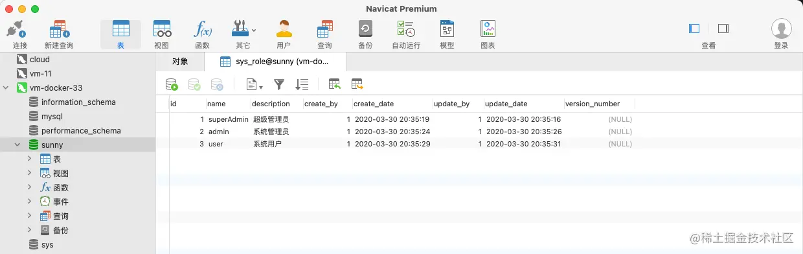

## 1、Docker搭建MySql并挂载数据
1、安装Docker
2、下载镜像Mysql5.7
```shell
docker pull mysql:5.7
```
3、创建容器并挂载数据
```shell
docker run -d --restart=always --name mysql \ -v /itwxe/dockerData/mysql/data:/var/lib/mysql \ -v /itwxe/dockerData/mysql/conf:/etc/mysql \ -v /itwxe/dockerData/mysql/log:/var/log/mysql \ -p 3306:3306 \ -e TZ=Asia/Shanghai \ -e MYSQL_ROOT_PASSWORD=123456 \ mysql:5.7 \ --character-set-server=utf8mb4 \ --collation-server=utf8mb4_general_ci
```
参数说明：
```shell
-v /itwxe/dockerData/mysql/data:/var/lib/mysql：将数据文件夹挂载到主机 -v /itwxe/dockerData/mysql/conf:/etc/mysql：将配置文件夹挂在到主机，可以在宿主机放一份自定义 my.cnf文件，那么容器就会按自定义配置启动 -v /itwxe/dockerData/mysql/log:/var/log/mysql：将日志文件夹挂载到主机 -p 3306:3306：将容器的3306端口映射到主机的3306端口 -e MYSQL_ROOT_PASSWORD=123456：初始化123456用户的密码 --character-set-server=utf8mb4：设置字符集 --collation-server=utf8mb4_general_ci：排序方式
```
4、进入Mysql容器内部。
```shell
docker exec -ut mysql /bin/bash
```
5、登录MySql
```shell
mysql -uroot -p123456
```
6、查看字符集是否有效。
```shell
show variables like 'character_set_%';
```
---
## 2、挂载是否有效
1、上传备份sql到宿主机，复杂宿主机备份sql到容器。
```shell
docker cp /itwxe/dockerData/sunny.sql.mysql:/
```
2、进入mysql容器内部，导入sql。
```shell
docker exec -it mysql /bin/bash
mysql -uroot -proot
create database sunny;
use sunny;
source /sunny.sql;
```
3、数据导入成功可以查询后，删除容器，并重新用命令创建容器，查看数据存在。
```shell
docker stop mysql && docker rm mysql
```
使用上面的命令重新创建容器，查看数据是否正常，可以看到数据正常挂载查询，此处演示的数据正常挂载保存宿主机。

