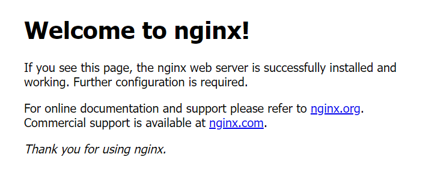
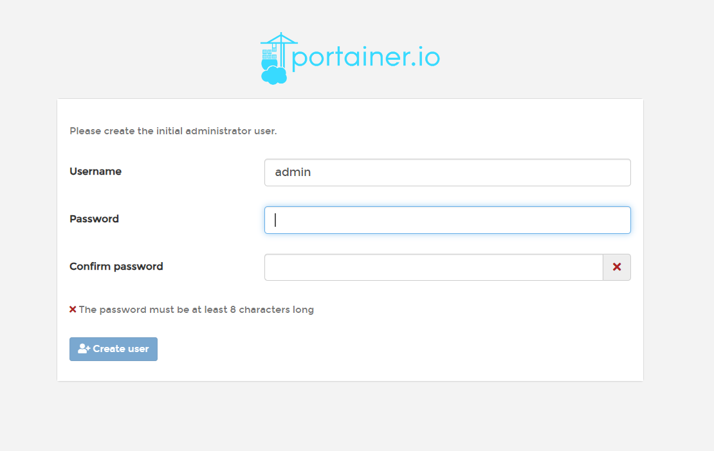

### 安装Docker
---
#### Docker的基本组成
---
##### Docker的架构图

##### 镜像（image）：
>Docker镜像（Image）就是一个只读的模板，镜像可以用来创建Docker容器，一个镜像可以创建很多日期，就好似Java中的类和对象，类就是镜像，容量就是对象！

##### 容器（container）：
>Docker 利用容器（Container）独立运行一个或一组应用。容器是用镜像创建的运行实例。
>它可以被启动、开始、停止、删除。每个容器都是相互隔离的，保证安全的平台。
>可以把容器看作是一个简易版的Linux环境（包括root用户权限、进程空间、用户空间和网络空间等）和运行在其中的应用程序。
>容器的定义和镜像几乎一模一样也是一堆层的统一视角，唯一区别在于容器的最上面那一层是可读可写的。

##### 仓库（repository）：
>仓库（Repository）是集中存放镜像文件的场所。
>仓库（Repository）和仓库注册服务器（Registry）是有区别的。仓库注册服务器上往往存放着多个仓库，每个仓库中又包含了多个镜像，每个镜像有不同的标签（tag）。
>仓库分为公开仓库（public）和私有仓库（Private）两种形式。
>最大的公开仓库是Docker Hub（https://hub.docker.com/），存放了数量庞大的镜像供用户下载。
>国内的公开仓库包括阿里云、网易云 等

##### 小结：
需要正确的理解仓库/镜像/容器这几个概念：
* Docker 本身是一个容器运行载体或称之为管理引擎。我们把应用程序和配置以来打包好形成一个 可交付的运行环境，这个打包好的运行环境就似乎image镜像文件。只有通过这个镜像文件才能生成Docker容器。image文件可以看作是容器的模板。Docker根据image文件生成容器的实例。同一个image文件，可以生成多个同时运行的容器实例。
* image文件生成的容器实例，本身也是一个文件，称为镜像文件。
* 一个容器运行一种服务，当我们需要的时候，就可以通过docker客户端创建一个对应的运行实例，也就是我们容器
* 至于仓库，就是放了一堆镜像的地方，我们可以把镜像发布到仓库中，需要的时候从仓库中拉下来就可以了。
##### 环境说明
我们使用的是Centos 7（64bit）
目前，Centos仅发布版本中的内核支持Docker。
Docker运行在Centos7上，要求系统为641位，系统内核版本为3.10以上。
###### 查看自己的内核：
`uname -r`命令用于打印当前系统相关信息（内核版本号、硬件架构、主机名称和操作系统类型等）。

```shell
$ uname -r
4.15.0-169-generic
```

######查看版本信息：
`cat /etc/os-release`
```shell
root@hecs-30245:~# cat /etc/os-release
NAME="Ubuntu"
VERSION="18.04.6 LTS (Bionic Beaver)"
ID=ubuntu
ID_LIKE=debian
PRETTY_NAME="Ubuntu 18.04.6 LTS"
VERSION_ID="18.04"
HOME_URL="https://www.ubuntu.com/"
SUPPORT_URL="https://help.ubuntu.com/"
BUG_REPORT_URL="https://bugs.launchpad.net/ubuntu/"
PRIVACY_POLICY_URL="https://www.ubuntu.com/legal/terms-and-policies/privacy-policy"
VERSION_CODENAME=bionic
UBUNTU_CODENAME=bionic
```

#### 安装步骤
1、官网安装参考手册：https://docs.docker.com/engine/install/centos/
2、确定你是Centos7及以上版本，我们已经做过了
3、yum安装gcc相关环境（需要确保 虚拟机可以上外网）
```shell
yum -y install gcc
yum -y install gcc-c++
```
4、卸载旧的版本
```shell
# 安装yum
apt install yum
# 删除旧版
 sudo yum remove docker \
                  docker-client \
                  docker-client-latest \
                  docker-common \
                  docker-latest \
                  docker-latest-logrotate \
                  docker-logrotate \
                  docker-engine
```
5、安装需要的软件包
```shell
yum install -y yum-utils
```
6、设置镜像仓库
```shell
# 错误
yum-config-manager --add-repo https://download.docker.com/linux/centos/docker-ce.repo ## 报错
[Errno 14] curl#35 - TCP connection reset by peer
[Errno 12] curl#35 - Timeout
```
```shell
# 正确推荐使用国内的
yum-config-manager --add-repo http://mirrors.aliyun.com/docker-ce/linux/centos/docker-ce.repo
```
7、安装yum软件包索引
```shell
yum makecache fast
```
8、安装Docker CE
```shell
yum install docker-ce docker-ce-cli containerd.io
```

9、启动Docker
```shell
systemctl start docker
```
10、测试命令
```shell
docker version

docker run hello-world

docker image
```


11、卸载
```shell
systemctl stop docker

yum -y remove docker-ce docker-ce-cli containerd.io

rm -rf /var/lib/docker
```

阿里云镜像加速
1、介绍：https://www.aliyun.com/product/acr 
2、注册一个属于自己的阿里云账户(可复用淘宝账号) 
3、进入管理控制台设置密码，开通 
4、查看镜像加速器自己的

5、配置镜像加速
```shell
sudo mkdir -p /etc/docker


sudo tee /etc/docker/daemon.json <<-'EOF' 
{ 
"registry-mirrors": ["https://dhr2h8gt.mirror.aliyuncs.com"] 
}
EOF

sudo systemctl daemon-reload

sudo systemctl restart docker
```

测试helloworld
1、启动helloworld
```shell
docker run hello-world
```
2、run干了什么？

##### 底层原理
###### Docker是怎么工作的
Docker是一个Client-Server结构的系统，Docker守护进程运行在主机上，然后通过Socket连接从客户端访问，守护进程从客户端接受命令并管理运行在主机上的容器。容器，是一个运行时环境，就是我们前面说到的集装箱。

###### 为什么Docker比较VM快
1、docker有着比虚拟机更少的抽象层，由于docker不需要Hypervisor实现硬件资源虚拟化，运行在docker容器上的程序直接使用的都是实际物理机的硬件资源，因此在CPU、内存利用率上docker将会在效率上有明显的优势。
2、docker利用的是宿主机的内核，而不需要Guest OS。因此，当新建一个容器时，docker不需要和虚拟机一样重新加载一个操作系统内核。仍而避免引寻、加载操作系统内核返个比较费资源的过程，当新建一个虚拟机时，虚拟机软件需要加载Guest OS，返个新建过程是分钟级别的。而docker由于直接利用宿主机的操作系统，这省略了返个过程，因此新建一个docker容器只需要几秒钟。


##### Docker常用命令
###### 帮助命令
```shell
docker version #显示 Docker 版本信息。
docker info    #显示 Docker 系统信息，包括镜像和容器数。。
docker --help  #帮助
```

######镜像命令
`docker image`
```shell
# 列出本地主机上的镜像
[root@VM-8-12-centos ~]# docker images
REPOSITORY    TAG       IMAGE ID       CREATED        SIZE
hello-world   latest    9c7a54a9a43c   4 months ago   13.3kB

# 解释
REPOSITORY   镜像的仓库源
TAG          镜像的标签
IMAGE ID     镜像的ID
CREATED      镜像创建时间
SIZE         镜像大小

# 同一个仓库可以有多个TAG，代表这个仓库源的不同版本，我们使用REPOSITORY：TAG定义不同的镜像，如果你不定义镜像的标签版本，docker将默认使用lastset镜像！

# 可选项
-a:         列出本地的所有镜像
-q:         只显示镜像id
--digests   显示镜像的摘要信息
```
`docker search`
```shell
# 搜索镜像
[root@VM-8-12-centos ~]# docker search mysql
NAME                            DESCRIPTION                                     STARS     OFFICIAL   AUTOMATED
mysql                           MySQL is a widely used, open-source relation…   14436     [OK]       

# docker search 某个镜像的名称   对应DockerHub仓库中的镜像

# 可选项
--filter=stars=50   ：列出收藏数量小于指定值的镜像。
```
`docker pull`
```shell
# 下载镜像
[root@VM-8-12-centos ~]# docker pull mysql
Using default tag: latest # 不写tag，默认是latest
latest: Pulling from library/mysql
b193354265ba: Downloading  5.504MB/44.91MB   # 分层下载
14a15c0bb358: Download complete 
02da291ad1e4: Download complete 
9a89a1d664ee: Download complete 
a24ae6513051: Download complete 
b85424247193: Download complete 
9a240a3b3d51: Download complete 
8bf57120f71f: Download complete 
c64090e82a0b: Downloading  2.703MB/57.49MB
af7c7515d542: Downloading     721B/5.39kB

Digest: sha256:e9027fe4d91c0153429607251656806cc784e914937271037f7738bd5b8e7709 # 签名
Status: Downloaded newer image for mysql:latest
docker.io/library/mysql:latest 真实位置

# 指定版本下载
[root@VM-8-12-centos ~]# docker pull mysql:5.7
```

`docker rmi`
```shell
# 删除镜像
docker rmi -f 镜像id                    #删除单个
docker rmi -f 镜像名:tag 镜像名:tag      #删除多个
docker rmi -f ${docker images -qa}      #删除全部
```
##### 容器命令
**说明**：有镜像才能创建容器，我们这里使用centos的镜像来测试，就是虚拟一个centos！
```shell
docker pull centos
```
###### 新建容器并启动
```shell
#命令
docker run [OPTIONS] IMAGE [COMMAND][ARG...]

#常用参数说明
--name="Name"             # 给容器指定一个名字
-d                        # 后台方式运行容器，并返回容器的id！
-i                        # 以交互模式运行容器，通过和-t一起使用
-t                        # 以容器重新分配一个终端，通常和 -i 一起使用
-P                        # 随机端口映射（大写）
-p                        # 指定端口映射（小结），一般可以有四种写法
     ip:hostPort:containerPort
     ip::containerPort
     hostPort:containerPort(常用)
     containerPort

# 测试
[root@VM-8-12-centos ~]# docker images
REPOSITORY    TAG       IMAGE ID       CREATED         SIZE
hello-world   latest    9c7a54a9a43c   4 months ago    13.3kB
mysql         5.7       c20987f18b13   20 months ago   448MB
mysql         latest    3218b38490ce   20 months ago   516MB
centos        latest    5d0da3dc9764   24 months ago   231MB

# 使用centos进行交互模式启动容器，在容器内执行/bin/bash命令！
[root@VM-8-12-centos ~]# docker run -it centos /bin/bash
[root@f18597556f8e /]# ls   # 注意地址，已经切换到容器内部了！
bin  etc   lib	  lost+found  mnt  proc  run   srv  tmp  var
dev  home  lib64  media       opt  root  sbin  sys  usr
[root@f18597556f8e /]# exit   # 使用exit 退出容器
exit
```

###### 列出运行的容器

```shell
# 命令
docker ps [OPTIONS]

# 常用参数说明
-a       # 列出当前所有正在运行的容器 + 历史运行过的容器
-l       # 显示最近创建的容器
-n=?     # 显示最近n个创建的容器
-q       # 静默模式，只显示容器编号。
```

###### 退出容器
```shell
exit       # 容器停止并退出
ctrl+P+Q   # 容器不停止退出
```
###### 启动停止容器
```shell
docker start (容器id or 容器名)        # 启动容器
docker restart (容器id or 容器名)      # 重启容器
docker stop (容器id or 容器名)         # 停止容器
docker kill (容器id or 容器名)         # 强制停止容器
```
##### 删除容器
```shell
docker rm 容器id                 # 删除指定容器
docker rm -f $(docker ps -a -q)  # 删除所有容器
docker ps -a -q|xargs docker rm  # 删除所有容器
```

#### 常用其他命令
###### 后台启动容器
```shell
# 命令
docker run -d 容器名

# 例子
docker run -d centos # 启动centos，使用后台方式启动

# 问题：使用docker ps 查看，发现容器已经退出了！
# 解释：Docker容器后台运行，就必须有一个有一个前台进程，容器的命令如果不是那些一直挂起的命令，就会自动退出。
# 比如，你运行了nginx服务，但是docker前台没有运行应用，这种情况下，容器启动后，会立即自杀，因为他觉得没有程序了，所以最好的情况是，将你的应用使用前台进程的方式运行启动。
```
##### 查看日志
```shell
# 命令
docker logs -f -t --tail 容器id

# 例子：我们启动centos，并编写一段脚本来测试玩玩！最后查看日志

[root@VM-8-12-centos ~]# docker run -d centos /bin/sh -c "while true;do echo liubr;sleep 1;done"
36a8b0882c3d71757e234a5b3210374ed5cdc92b56684af0c84446d552e9c15d

[root@VM-8-12-centos ~]# docker ps
CONTAINER ID   IMAGE     COMMAND                  CREATED         STATUS         PORTS     NAMES
36a8b0882c3d   centos    "/bin/sh -c 'while t…"   6 seconds ago   Up 5 seconds    admiring_cray


# -t 显示时间戳
# -f 打印最新的日志
# --tail 数字   显示多少条！
[root@VM-8-12-centos ~]# docker logs -tf --tail 10 36a8b0882c3d
2023-09-09T14:24:45.068203922Z liubr
2023-09-09T14:24:46.070795094Z liubr
2023-09-09T14:24:47.073302616Z liubr
2023-09-09T14:24:48.075813453Z liubr
2023-09-09T14:24:49.078313895Z liubr
2023-09-09T14:24:50.080864154Z liubr
2023-09-09T14:24:51.083440922Z liubr
2023-09-09T14:24:52.086020299Z liubr
# 命令
docker top 容器id

# 测试
[root@VM-8-12-centos ~]# docker top 36a8b0882c3d
UID    PID    PPID   C    STIME  TTY   TIME      CMD
root  15999  5978    0    22:24   ?   00:00:00  /bin/sh -c while true;do...
```
###### 查看容器/镜像的元数据
```shell
# 命令
docker inspect 容器id

# 测试
[root@VM-8-12-centos ~]# docker inspect 36a8b0882c3d
[
    {
        "Id": "36a8b0882c3d71757e234a5b3210374ed5cdc92b56684af0c84446d552e9c15d",
        "Created": "2023-09-09T14:24:09.703818195Z",
        "Path": "/bin/sh",
        "Args": [
            "-c",
            "while true;do echo liubr;sleep 1;done"
        ],
        "State": {
            "Status": "running",
            "Running": true,
            "Paused": false,
            "Restarting": false,
            "OOMKilled": false,
            "Dead": false,
            "Pid": 15999,
            "ExitCode": 0,
            "Error": "",
            "StartedAt": "2023-09-09T14:24:09.9674008Z",
            "FinishedAt": "0001-01-01T00:00:00Z"
        },
	//...
]
```
###### 进入正在运行的容器
```shell
# 命令1
docker exec -it 容器id bashShell

# 测试1
[root@VM-8-12-centos ~]# clear
[root@VM-8-12-centos ~]# docker ps
CONTAINER ID   IMAGE     COMMAND                  CREATED          STATUS          PORTS     NAMES
36a8b0882c3d   centos    "/bin/sh -c 'while t…"   12 minutes ago   Up 12 minutes             admiring_cray
[root@VM-8-12-centos ~]# docker exec -it 36a8b0882c3d /bin/bash
[root@36a8b0882c3d /]# ps -ef
UID        PID  PPID  C STIME TTY          TIME CMD
root         1     0  0 14:24 ?        00:00:00 /bin/sh -c while true;do echo liubr;sleep 1;done
root      1311     0  0 14:45 pts/0    00:00:00 /bin/bash
root      1329     1  0 14:46 ?        00:00:00 /usr/bin/coreutils --coreutils-prog-shebang=sleep 
root      1330  1311  0 14:46 pts/0    00:00:00 ps -ef

# 命令2
docker attach 容器id

# 测试2
[root@VM-8-12-centos ~]# docker exec -it 36a8b0882c3d /bin/bash
[root@36a8b0882c3d /]# ps -ef
UID        PID  PPID  C STIME TTY          TIME CMD
root         1     0  0 14:24 ?        00:00:00 /bin/sh -c while true;do echo liubr;sleep 1;done
root      1595     0  0 14:50 pts/0    00:00:00 /bin/bash
root      1692     1  0 14:51 ?        00:00:00 /usr/bin/coreutils --coreutils-prog-shebang=sleep 
root      1693  1595  0 14:51 pts/0    00:00:00 ps -ef

# 区别
# exec   是在容器中打开新的终端，并且可以启动新的进程 
# attach 直接进入容器启动命令的终端，不会启动新的进程
```

##### 从容器内拷贝文件到主机上
```shell
# 命令
docker cp 容器id:容器内路径 目的主机路径

# 测试
# 容器内执行，创建一个文件测试
[root@70d61ecedcbc /]# cd home
[root@70d61ecedcbc home]# touch f1
[root@70d61ecedcbc home]# ls
f1
[root@70d61ecedcbc home]# exit
exit
[root@VM-8-12-centos ~]# docker cp 70d61ecedcbc:/home/f1 /home
Successfully copied 1.54kB to /home
[root@VM-8-12-centos ~]# cd /home
[root@VM-8-12-centos home]# ls
f1  lighthouse
```

#### 小结


常用命令

```docker
attach    Attach to a running container                 # 当前 shell 下 attach 连接指定运行镜像
build     Build an image from a Dockerfile              # 通过 Dockerfile 定制镜像
commit    Create a new image from a container changes   # 提交当前容器为新的镜像 
cp        Copy files/folders from the containers filesystem to the host path #从容器中拷贝指定文件或者目录到宿主机中
create    Create a new container                        # 创建一个新的容器，同run，但不启动容器
diff      Inspect changes on a container's filesystem   # 查看 docker 容器变化 
events    Get real time events from the server          # 从 docker 服务获取容器实时事件
exec      Run a command in an existing container        # 在已存在的容器上运行命令
export    Stream the contents of a container as a tar archive   # 导出容器的内容流作为一个 tar 归档文件[对应 import ]
history   Show the history of an image                  # 展示一个镜像形成历史 
images    List images                                   # 列出系统当前镜像
import    Create a new filesystem image from the contents of a tarball # 从 tar包中的内容创建一个新的文件系统映像[对应export]
info      Display system-wide information               # 显示系统相关信息 
inspect   Return low-level information on a container   # 查看容器详细信息
kill      Kill a running container                      # kill 指定 docker 容器
load      Load an image from a tar archive              # 从一个 tar 包中加载一个镜像[对应 save]
login     Register or Login to the docker registry server    # 注册或者登陆一个 docker 源服务器
logout    Log out from a Docker registry server          # 从当前 Docker registry 退出
logs      Fetch the logs of a container                 # 输出当前容器日志信息 port      Lookup the public-facing port which is NAT-ed to PRIVATE_PORT    # 查看映射端口对应的容器内部源端口
pause     Pause all processes within a container        # 暂停容器
ps        List containers                               # 列出容器列表
pull      Pull an image or a repository from the docker registry server   # 从docker镜像源服务器拉取指定镜像或者库镜像
push      Push an image or a repository to the docker registry server    # 推送指定镜像或者库镜像至docker源服务器
restart   Restart a running container                   # 重启运行的容器
rm        Remove one or more containers                 # 移除一个或者多个容器 
rmi       Remove one or more images             # 移除一个或多个镜像[无容器使用该镜像才可删除，否则需删除相关容器才可继续或 -f 强制删除]
run       Run a command in a new container              # 创建一个新的容器并运行一个命令
save      Save an image to a tar archive                # 保存一个镜像为一个tar 包[对应 load]
search    Search for an image on the Docker Hub         # 在 docker hub 中搜索镜像
start     Start a stopped containers                    # 启动容器
stop      Stop a running containers                     # 停止容器
tag       Tag an image into a repository                # 给源中镜像打标签
top       Lookup the running processes of a container   # 查看容器中运行的进程信息
unpause   Unpause a paused container                    # 取消暂停容器
version   Show the docker version information           # 查看 docker 版本号 
wait      Block until a container stops, then print its exit code   # 截取容
器停止时的退出状态值
```

#### 作业练习
---
> 使用Docker安装Nginx
```
# 1、搜索镜像
[root@VM-8-12-centos ~]# docker search nginx
NAME           DESCRIPTION                    STARS    
nginx         Official build of Nginx.         18986

# 2、拉取镜像
[root@VM-8-12-centos ~]# docker pull nginx
Using default tag: latest
latest: Pulling from library/nginx
a2abf6c4d29d: Pull complete 
a9edb18cadd1: Pull complete 
589b7251471a: Pull complete 
186b1aaa4aa6: Pull complete 
b4df32aa5a72: Pull complete 
a0bcbecc962e: Pull complete 
Digest: sha256:0d17b565c37bcbd895e9d92315a05c1c3c9a29f762b011a10c54a66cd53c9b31
Status: Downloaded newer image for nginx:latest
docker.io/library/nginx:latest

# 3、启动容器
[root@VM-8-12-centos ~]# docker images
REPOSITORY    TAG       IMAGE ID       CREATED         SIZE
hello-world   latest    9c7a54a9a43c   4 months ago    13.3kB
nginx         latest    605c77e624dd   20 months ago   141MB
mysql         5.7       c20987f18b13   20 months ago   448MB
mysql         latest    3218b38490ce   20 months ago   516MB
centos        latest    5d0da3dc9764   24 months ago   231MB

[root@VM-8-12-centos ~]# docker run -d --name mynginx -p 3500:80 nginx
9fdfbbd35c95f2756a68bc3de1c82441f0c244ef7a71949693626f780b953393

[root@VM-8-12-centos ~]# docker ps
CONTAINER ID   IMAGE     COMMAND                  CREATED         STATUS         PORTS                                   NAMES
9fdfbbd35c95   nginx     "/docker-entrypoint.…"   8 seconds ago   Up 7 seconds 0.0.0.0:3500->80/tcp, :::3500->80/tcp   mynginx

# 4、测试访问
[root@VM-8-12-centos ~]# curl localhost:3500
<html>
<title>Welcome to nginx!</title>
...
</html>

# 5、进入容器
 [root@VM-8-12-centos ~]# docker exec -it mynginx /bin/bash
root@9fdfbbd35c95:/# whereis nginx 
nginx: /usr/sbin/nginx /usr/lib/nginx /etc/nginx /usr/share/nginx
root@9fdfbbd35c95:/# cd /usr/share/nginx
root@9fdfbbd35c95:/usr/share/nginx# ls
html
root@9fdfbbd35c95:/usr/share/nginx# cd html
root@9fdfbbd35c95:/usr/share/nginx/html# ls
50x.html  index.html
root@9fdfbbd35c95:/usr/share/nginx/html# cat index.html 
<!DOCTYPE html>
<html>
<head>
<title>Welcome to nginx!</title>
<style>
html { color-scheme: light dark; }
body { width: 35em; margin: 0 auto;
font-family: Tahoma, Verdana, Arial, sans-serif; }
</style>
</head>
<body>
<h1>Welcome to nginx!</h1>
<p>If you see this page, the nginx web server is successfully installed and
working. Further configuration is required.</p>

<p>For online documentation and support please refer to
<a href="http://nginx.org/">nginx.org</a>.<br/>
Commercial support is available at
<a href="http://nginx.com/">nginx.com</a>.</p>

<p><em>Thank you for using nginx.</em></p>
</body>
</html>
```
开放TCP/UDP端口

浏览器正常访问


> 使用docker安装tomcat
```shell
# 官网文档解锁
# -it ：交互模式
# --rm ：容器启动成功并退出以后容器自动移除，一般在测试情况下使用！
docker run -it --rm tomcat:9.0

# 1、下载tomcat镜像
docker pull tomcat

# 2、启动
docker run -d -p 8080:8080 --name tomcat9 tomcat

# 3、进入tomcat
docker exec -it tomcat9 /bin/bash

# 4、思考：我们以后要部署项目，还需要进入容器中，是不是十分麻烦，要是有一种技术，可以将容器内和我们Linux进行映射挂载就好了？我们后面会将数据卷技术来进行挂载操作，也是一个核心内容，这里大家先听听名词就好，我们很快就会讲到！
```

>使用 docker 部署 es + kibana

```shell
# 我们启动es这种容器需要考虑几个问题
1、端口暴露问题9200、9300
2、数据卷的挂载问题 data、plugins、conf
3、吃内存  -“ES_JAVA_OPTS=-Xms512m -Xmx512”

# 扩展命令
docker stats 容器id    # 查看容器的cpu内存和网络状态

# 1、启动es测试
docker run -d --name elasticsearch -p 9200:9200 -p 9300:9300 -e "discovery.type=single-node" elasticsearch:7.6.2

# 2、启动之后很卡，使用docker stats 容器 id 查看cpu状态 ， 发现占用的很大
CONTAINER ID   NAME          CPU %  MEM USAGE / LIMIT   MEM %   NET I/O     BLOCK I/O       PIDS
df3910010035  elasticsearch  0.03%  1.26GiB / 1.952GiB  64.58%  656B / 0B   166MB / 729kB   42

# 3、测试访问
[root@VM-8-12-centos ~]# curl localhost:9200
{
  "name" : "df3910010035",
  "cluster_name" : "docker-cluster",
  "cluster_uuid" : "r0f9Z3vRSmekBlxkdHSy6A",
  "version" : {
    "number" : "7.6.2",
    "build_flavor" : "default",
    "build_type" : "docker",
    "build_hash" : "ef48eb35cf30adf4db14086e8aabd07ef6fb113f",
    "build_date" : "2020-03-26T06:34:37.794943Z",
    "build_snapshot" : false,
    "lucene_version" : "8.4.0",
    "minimum_wire_compatibility_version" : "6.8.0",
    "minimum_index_compatibility_version" : "6.0.0-beta1"
  },
  "tagline" : "You Know, for Search"
}

# 4、增加上内存限制启动
docker run -d --name elasticsearch -p 9200:9200 -p 9300:9300 -e "discovey.type=single-node" -e ES_JAVA_OPTS="-Xms64m -Xmx512m" elasticsearch:7.6.2

# 5、启动之后，使用 docker stats 查看下 cpu 状态
CONTAINER ID   NAME        CPU %     MEM USAGE / LIMIT   MEM %   NET I/O   BLOCK I/O      PIDS
9f7b62dc48b7  elasticsearch  0.81%  382.5MiB / 1.952GiB  19.14%  656B / 0B 106MB / 729kB   44

# 6、访问测试，效果一样，ok
[root@VM-8-12-centos ~]# curl localhost:9200

# 思考：如果我们要使用 kibana ， 如果配置连接上我们的es呢？网络该如何配置呢？
```

#### 可视化
* Portainer（先用这个）
```shell
docker run -d -p 8088:9000 \
--restart=always -v /var/run/docker.sock:/var/run/docker.sock --privileged=true portainer/portainer
```

* Rancher（CI/CD再用这个）
```shell
# 安装rancher-server
docker run --name rancher-server -p 8000:8080 -v /ect/localtime:/etc/localtime:ro -d rancher/server
# 安装agent
docker run --rm --privileged -v /var/run/docker.sock:/var/run/docker.sock -v /var/lib/rancher:/var/lib/rancher rancher/agent:v1.2.11 http://39.101.191.131:8000/v1/scripts/D3DBD43F263109BB881F:1577750400000:7M0y BzCw4XSxJklD7TpysYIpI
```
#### 介绍
Portaine 是 Docker 的图形化管理工具，提供状态显示面板、应用模板快速部署、容器镜像网络数据卷的基本操作（包括上传下载镜像，创建容器等操作）、事件日志显示、容器控制台操作、Swarm集群和服务等集中管理和操作、登录用户管理和控制等功能。功能十分全面，基本能满足中小型单位对容器管理的全部需求。
如果仅有一个 docker 宿主机，则可以使用单机版运行，Portainer单机版运行十分简单，只需要一条语句即可启动容器，来管理该机器上的docker镜像、容器等数据。
```shell
docker run -d -p 8088:9000 \
--restart=always -v /var/run/docker.sock:/var/run/docker.sock --privileged=true portainer/portainer
```
访问方式：http://IP:8088
首次登陆需要注册用户，给admin用户设置密码：

单机版这里选择local即可，选择完毕，点击Connect即可连接到本地docker：

登录成功！


#### Docker镜像讲解
##### 镜像是什么
镜像是一种轻量级、可执行的独立软件包，用来打包软件运行环境和基本运行环境开发的软件，它包含某个软件所有内容，包括代码、运行时、库、环境变量和配置文件。

##### Docker镜像加载原理
>UnionFS （联合文件系统）

UnionFS（联合文件系统）：Union文件系统（UnionFS）是一种分层、轻量化并且高性能的文件系统，它支持系统的修改作为一次提交来一层层的叠加，同时可以将不同目录挂载到同一个目录挂载到同一个虚拟文件系统下（unite several directories into a single virtual filesystem）。Union 文件系统是Docker镜像的基础。镜像可以通过分层来进行继承，基于基础镜像（没有父镜像），可以制作各种具体的应用镜像。
特性：一次同时加载多个文件系统，但从外面看起来，只能看到一个文件系统，联合加载会把各层文件系统叠加起来，这样最终的文件系统会包含所有的底层的文件和目录

>Docker 镜像加载原理

docker的镜像实际上由一层一层的文件系统组成，这种层级的文件系统UnionFS。
bootfs(boot file system)主要包含bootloader和kernel，bootloader主要是引导加载kernel，Linux刚启动时会加载bootfs文件系统，在Docker镜像的最底层是bootfs。这一层与我们典型的Linux/Unix系统是一样的，包含boot加载器和内核。当boot加载完成之后整个内核就都在内存中了，此时内存的使用权已由bootfs转交给内核，此时系统也会卸载bootfs。

rootfs(root file system)，在 bootfs之上。包含的就是典型 Linux 系统中的 /dev. /proc, /bin, /etc 等标准目录和文件，rootfs就是各种不同的操作系统发行版，比如 Ubuntu，Centos 等。


平时我们安装进去虚拟机的Centos都是好几个G，为什么Docker这里才200M？


对于一个精简的OS，rootfs可以很小，只需要包含最基本的命令，工具和程序库就可以了， 因为底层直接用 Host 的 kernel，自己只需要提供rootfs就可以了。由此可见对于不同的linux发行版，bootfs基本是一致的，rootfs会有差别，因此不同的发行版可以公用bootfs。

#### 分层理解
>分层的镜像

我们可以去下载一个镜像，注意观察下载的日志输出，可以看到是一层一层的在下载！


思考：为什么 Docker 镜像要采用这种分层的结构呢？

最大的好处，我觉得莫过于是资源共享了！比如有多个镜像都是从相同的Base镜像构建而来，那么宿主机只需要在磁盘上保留一份bash镜像，同时内存中也只需要加载一份bash镜像，这样就可以为所有的容器服务了，而且镜像的每一层都可以共享。

查看镜像分层的方式可以通过 docker image inspect 命令！

```json
[root@VM-8-12-centos ~]# docker image inspect redis:latest
[
    //....
        "RootFS": {
            "Type": "layers",
            "Layers": [
                "sha256:2edcec3590a4ec7f40cf0743c15d78fb39d8326bc029073b41ef9727da6c851f",
                "sha256:9b24afeb7c2f21e50a686ead025823cd2c6e9730c013ca77ad5f115c079b57cb",
                "sha256:4b8e2801e0f956a4220c32e2c8b0a590e6f9bd2420ec65453685246b82766ea1",
                "sha256:529cdb636f61e95ab91a62a51526a84fd7314d6aab0d414040796150b4522372",
                "sha256:9975392591f2777d6bf4d9919ad1b2c9afa12f9a9b4d260f45025ec3cc9b18ed",
                "sha256:8e5669d8329116b8444b9bbb1663dda568ede12d3dbcce950199b582f6e94952"
            ]
        },
        "Metadata": {
            "LastTagTime": "0001-01-01T00:00:00Z"
        }
    }
]
```

###### 理解：
所有的 Docker 镜像都起始于一个基础镜像层，当进行修改或增加新的内容时，就会当前镜像层之上，创建新的镜像层。

举一个简单的例子，假如基于Ubuntu Linux 16.04 创建一个新的镜像，这就是新的镜像的第一层；如果在该镜像中添加Python包，就会在基础镜像层之上创建第二个镜像层；如果继续添加一个安全补丁，就会创建第三个镜像层。

该镜像当前已经包含3个镜像层，如下图所示（这只是一个用于演示的很简单的例子）。


在添加额外的镜像层的同时，镜像始终保持是当前所有镜像的组合，理解这一点非常重要。下图中举了一个简单的例子，每个镜像层包含3个文件，而镜像包含了来自两个镜像层的6个文件。


上图中的镜像层跟之前图中的略有区别，主要目的是便于展示文件。

下图中展示了一个稍微复杂的三层镜像，在外部看来整个镜像只有6个文件，这是因为最上层中的文件7是文件5的一个最新版本。


这种情况下，上层镜像层中的文件覆盖了底层镜像层中的文件。这样就使得文件的最新版本作为一个新的镜像层添加到镜像当中。

Docker 通过存储引擎（新版本采用快照机制）的方式来实现镜像层堆栈，并保证多镜像层对外展示为统一的文件系统。

Linux 上可用的存储引擎有 AUFS、Overlay2、Device Mapper、Btrfs 以及 ZFS。顾名思义，每种存储引擎都基于 Linux 中对应的文件系统或者块设备技术，并且每种存储引擎都有其独有的性能特点。

Docker 在 Windows 上仅支持 windowsfilter 一种存储引擎，该引擎基于NTFS 文件系统之上实现了分层和CoW

下图展示了与系统显示相同的三层镜像。所有镜像成堆叠并合并，对外提供统一的试图。

  

>特点

Docker 镜像都是只读的，当容器启动时，一个新的可写层被加载到镜像的顶部！
这一层就是我们通常说的容器层，容器之下的都叫镜像层！

##### 镜像Commit
---
**docker commit 从容器创建一个新的镜像。**

```shell
docker commit 提交容器副本使之成为一个新的镜像！

# 语法
docker commit -m="提交的描述信息" -a="作者" 容器id 要创建的目标镜像名:[标签名]
```
###### 测试
```shell
# 1、从Docker Hub 下载tomcat镜像到本地并运行 -it 交互终端 -p 端口映射
docker run -it -p 8080:8080 tomcat

# 注意：坑爹：docker启动官方tomcat镜像的容器，发现404是因为使用了加速器，而加速器里的tomcat的webapps下没有root等文件！
# 下载tomcat官方镜像，就是这个镜像（阿里云里的tomcat的webapps下没有任何文件）
# 进入tomcat查看webapps下发现全部是空的，反而有个webapps.dist里有对应文件，cp -r到webapps下！
[root@VM-8-12-centos ~]# docker run -it -p 8080:8080 tomcat 

# 2、删除上一步镜像产生的tomcat容器的文档
docker ps    # 查看容器id
docker exec -it 容器id /bin/bash
打开一个新的窗口
[root@VM-8-12-centos ~]# docker exec -it 661dc8ea90a8 /bin/bash
root@661dc8ea90a8:/usr/local/tomcat# cp -r webapps.dist/* webapps
root@661dc8ea90a8:/usr/local/tomcat# cd webapps
root@661dc8ea90a8:/usr/local/tomcat/webapps# ls -l  # 查看是否存在 docs 文件
root@661dc8ea90a8:/usr/local/tomcat/webapps# curl localhost:8080/docs/  # 返回docs的内容
root@661dc8ea90a8:/usr/local/tomcat/webapps# rm -rf docs/   # 删除文件
root@661dc8ea90a8:/usr/local/tomcat/webapps# curl localhost:8080/docs/  # 返回404

# 3、当前运行的 tomcat 实例就是一个没有docs的容器，我们使用它为容器commit一个没有docs的tomcat新镜像，tomcat02

docker ps -l  # 查看容器的id

# 注意：commit的时候，容器的名字不能时大写，否则报错：invalid reference format
[root@VM-8-12-centos ~]# docker commit -a="liubr" -m="no tomcat docs" 661dc8ea90a8 tomcat02:0.0.1

sha256:835399cf2bcdefa9c6171c7c1bafb0e511e96f9f240585a6d64e9c388b88b644

[root@VM-8-12-centos ~]# docker images # 查看，我们提交的镜像
REPOSITORY            TAG       IMAGE ID       CREATED         SIZE
tomcat02              0.0.1     835399cf2bcd   7 seconds ago   681MB
hello-world           latest    9c7a54a9a43c   4 months ago    13.3kB
nginx                 latest    605c77e624dd   20 months ago   141MB
tomcat                9.0       b8e65a4d736d   20 months ago   680MB
tomcat                latest    fb5657adc892   20 months ago   680MB
# 4、这个时候我们可以使用，大家可以起到原来的tomcat，和我们新的tomcat02，来测试看看！
[root@VM-8-12-centos ~]# docker run -it -p 8080:8080 tomcat02:0.0.1

# 如果你想要保存你的当前状态，可以通过commit，来提交镜像，方便使用，类似于 VM 中的快照！
```

#### 容器数据卷
##### 什么是容器数据卷
**docker的理念回顾**
将应用和运行的环境打包形成容器运行，运行可以伴随着容器，但是我们对于数据的要求，是希望能够持久化的！
就好比，你安装一个MySQL，结果你把容器删了，就相当于删库跑路了，这TM也太扯了吧！
所以我们希望容器之间有可能可以共享数据，Docker容器产生的数据，如果不通过docker commit生成新的镜像，使得数据作为镜像的一部风保存下来，那么当容器删除后，数据自然也就没有了！这样是行不通的！
为了能保存数据在Docker中我们就可以使用卷！让数据挂载到我们本地！这样数据就不会因为容器删除而丢失了！
###### 作用：
卷就是目录或者文件，存在一个或者多个容器中，由docker挂载到容器，但不属于联合文件系统，因此能够绕过Union File System，提供一些用于持续存储或共享数据的特征：
卷的设计目的就是数据的持久化，完全独立于容器的生存周期，因此Docker不会在容器删除时删除其挂载的数据卷。
###### 特点：
1、数据可在容器之间共享或重用数据
2、卷中的更改可以直接生效
3、数据卷中的更改不会包含在镜像的更新中
4、数据卷的生命周期一直持续到没有容器使用它为止
**所以：总结一句话：就是容器的持久化，以及荣期间的继承和数据共享！**

##### 使用数据卷
>方式一：容器中直接使用命令来添加

挂载
```shell
# 命令
docker run -it -v 宿主机绝对路径目录:容器内目录 镜像名

# 测试
[root@VM-8-12-centos ~]# docker run -it -v /home/ceshi:/home centos /bin/bash
```
查看数据卷是否挂载成功 `docker inspect 容器id`


测试容器和宿主机之间数据共享：可以发现，在容器中，创建的会在宿主机中看到！


测试容器停止退出后，主机修改数据是否会同步！
1、停止容器
2、在宿主机上修改文件，增加些内容
3、启动刚才停止的容器
4、然后查看对应的文件，发现数据依旧同步！ok


>使用docker安装mysql

思考：mysql数据持久化的问题！
```
# 1、搜索镜像
[root@VM-8-12-centos ~]# docker search mysql
NAME                            DESCRIPTION                                     STARS     OFFICIAL   AUTOMATED
mysql                           MySQL is a widely used, open-source relation…   14446     [OK]       
mariadb                         MariaDB Server is a high performing open sou…   5513      [OK] 

# 2、拉取镜像
[root@VM-8-12-centos ~]# docker pull mysql:5.7
5.7: Pulling from library/mysql
Digest: sha256:f2ad209efe9c67104167fc609cca6973c8422939491c9345270175a300419f94
Status: Image is up to date for mysql:5.7
docker.io/library/mysql:5.7

# 3、启动容器 -e 环境变量！
# 注意： mysql的数据应该不丢失! 先体验下！ 参考官方文档
[root@VM-8-12-centos ~]# docker run -d -p 3310:3306 -v /home/mysql/conf:/etc/mysql/conf.d -v /home/mysql/data:/var/lib/mysql -e MYSQL_ROOT_PASSWORD=123456 --name mysql01 mysql:5.7
3f9e5a21745e840505875bf32cbace6f8297f37d37fb45026697c673c7ae0f9d

# 4、使用本地的navicat连接测试一下 3310

# 5、查看本地 /home/mysql 目录
[root@VM-8-12-centos data]# pwd
/home/mysql/data
[root@VM-8-12-centos data]# ls # 可以看到我们刚刚创建的mysql数据库在本地存储着
auto.cnf         client-key.pem  ib_logfile1         private_key.pem  sys
ca-key.pem       ib_buffer_pool  ibtmp1              public_key.pem
ca.pem           ibdata1         mysql               server-cert.pem
client-cert.pem  ib_logfile0     performance_schema  server-key.pem

# 6、删除mysql容器
[root@VM-8-12-centos data]# docker rm -f mysql01  # 删除容器，然后发现远程连接失败！
mysql01
[root@VM-8-12-centos data]# ls  # 可以看到我们刚刚建立的mysql数据库在本地存储着
auto.cnf         client-key.pem  ib_logfile1         private_key.pem  sys
ca-key.pem       ib_buffer_pool  ibtmp1              public_key.pem
ca.pem           ibdata1         mysql               server-cert.pem
client-cert.pem  ib_logfile0     performance_schema  server-key.pem
```

>通过Docker File 来添加（了解）

DockerFile 是用来创建Docker镜像的构造文件，是由一些列命令和参数构成脚本。
我们在这里，先体验一下，后面我们会详细讲解DockerFile！

测试：
```shell
# 1、我们在宿主机 /home 目录下新建一个 docker-test-volume文件夹
[root@VM-8-12-centos home]# mkdir docker-test-volume

# 说明：在编写DockerFile文件中使用 VOLUME 指令来给镜像添加一个或多个数据卷
VOLUME["/dataVolumeContainer1","/dataVolumeContainer2","/dataVolumeContainer3"]
# 出于可移植和分享的考虑，我们之前使用的 -v 主机目录:容器目录 这种方式不能够直接在DockerFile中实现。
# 由于宿主机目录是依赖于特定宿主机的，并不能够保证在所有宿主机上都存在这样的特定目录。

# 2、编写DockerFile文件
[root@VM-8-12-centos docker-test-volume]# pwd
/home/docker-test-volume
[root@VM-8-12-centos docker-test-volume]# vim dockerfile1
[root@VM-8-12-centos docker-test-volume]# cat dockerfile1 
# volume test
FROM centos
VOLUME ["/dataVolumeContainer1","dataVolumeContainer2"]
CMD echo "-----end-----"
CMD /bin/bash

# 3、build后生成镜像，获得一个新的镜像 coding/centos
docker build -f /home/docker-test-volume/dockerfile1 -t coding/centos . # 注意最后有个.
```

```shell
# 4、启动容器
[root@VM-8-12-centos docker-test-volume]# docker run -it a4f04617f052 /bin/bash #启动容器
[root@713dca146eb9 /]# ls -l
total 56
lrwxrwxrwx   1 root root    7 Nov  3  2020 bin -> usr/bin
drwxr-xr-x   2 root root 4096 Sep 14 07:25 dataVolumeContainer1 # 数据卷目录
drwxr-xr-x   2 root root 4096 Sep 14 07:25 dataVolumeContainer2 # 数据卷目录
drwxr-xr-x   5 root root  360 Sep 14 07:25 dev
drwxr-xr-x   1 root root 4096 Sep 14 07:25 etc
drwxr-xr-x   2 root root 4096 Nov  3  2020 home

# 问题：通过上述步骤：容器内的卷目录地址就已经知道了，但是对应的主机目录地址在哪里呢？

# 5、我们在数据卷中新建一个文件
[root@713dca146eb9 dataVolumeContainer1]# pwd
/dataVolumeContainer1
[root@713dca146eb9 dataVolumeContainer1]# touch container.txt
[root@713dca146eb9 dataVolumeContainer1]# ls -l
total 0
-rw-r--r-- 1 root root 0 Sep 14 07:29 container.txt

# 6、查看下这个容器的信息
[root@VM-8-12-centos ~]# docker inspect 713dca146eb9
# 查看输出的Volumes
"Volumes": {
	"/dataVolumeContainer1": {},
	"dataVolumeContainer2": {}
},

# 7、这个卷在主机对应的默认位置
```


注意：如果访问出现了cannot open directory：Permission denied
解决办法：在挂载目录后多加一个 --privileged=true参数即可

#### 匿名和具名
```shell
-v 容器内路径
docker run -d -p --name nginx01 -v /etc/nginx nginx

# 匿名挂载的缺点，就是不好维护，通常使用命令 docker volume 维护
docker volume ls

# 具名挂载
-v 卷名:/容器内路径
docker run -d -p --name nginx02 -v nginxconfig:/etc/nginx nginx

# 查看挂载的路径
[root@VM-8-12-centos _data]# docker volume inspect nginxconfig
[
    {
        "CreatedAt": "2023-09-14T15:53:43+08:00",
        "Driver": "local",
        "Labels": null,
        "Mountpoint": "/var/lib/docker/volumes/nginxconfig/_data",
        "Name": "nginxconfig",
        "Options": null,
        "Scope": "local"
    }
]

# 怎么判断挂载的是卷名而不是本机目录名？
不是/开始就是卷名，  是/开始就是目录名

# 改变文件的读写权限
# ro：readonly
# rw：readwrite
# 指定容器对我们挂载出来的内容的读写权限
docker run -d -P name nginx02 -v nginxconfig:/etc/nginx:ro nginx
docker run -d -P name nginx02 -v nginxconfig:/etc/nginx:rw nginx
```

#### 数据卷容器
命名的容器挂载数据卷，其他容器通过挂载这个（父容器）实现数据共享，挂载数据卷的容器，称之为数据卷容器。
我们使用上一步的镜像：kuangshen/centos为模板，运行容器docker01，docker02，docker03，他们都会具有容器卷
```shell
"/dataVolumeContainer1"
"/dataVolumeContainer2"
```
###### 我们来测试下，容器之间传递共享
1、先启动一个父容器docker01，然后在dataVolumeContainer2新增文件


退出不停止`ctrl + P + Q`
2、创建docker02，docker03让他们继承docker01  `--volumes-from`

```shell
[root@VM-8-12-centos docker-test-volume]# docker run -it --name docker02 --volumes-from docker01 coding/centos
[root@4ed2289ea5bc /]# cd /dataVolumeContainer2
[root@4ed2289ea5bc dataVolumeContainer2]# ls
docker01.txt
[root@4ed2289ea5bc dataVolumeContainer2]# touch docker02.txt
[root@4ed2289ea5bc dataVolumeContainer2]# ls
docker01.txt  docker02.txt

[root@VM-8-12-centos docker-test-volume]# docker run -it --name docker03 --volumes-from docker01 coding/centos
[root@db67535f71d1 /]# cd dataVolumeContainer2
[root@db67535f71d1 dataVolumeContainer2]# ls
docker01.txt  docker02.txt
[root@db67535f71d1 dataVolumeContainer2]# touch docker03.txt
[root@db67535f71d1 dataVolumeContainer2]# ls
docker01.txt  docker02.txt  docker03.txt
```
3、回到docker01发现可以看到02和03添加的共享文件
```shell
[root@VM-8-12-centos docker-test-volume]# docker attach docker01
[root@6c325aace53c dataVolumeContainer2]# ls -l
total 0
-rw-r--r-- 1 root root 0 Sep 14 08:06 docker01.txt
-rw-r--r-- 1 root root 0 Sep 14 08:12 docker02.txt
-rw-r--r-- 1 root root 0 Sep 14 08:16 docker03.txt
```
4、删除docker01，docker02 修改docker03还能不能访问
```shell
[root@VM-8-12-centos docker-test-volume]# docker rm -f docker01
docker01
[root@VM-8-12-centos docker-test-volume]# docker attach docker02
[root@4ed2289ea5bc dataVolumeContainer2]# ls -l 
total 0
-rw-r--r-- 1 root root 0 Sep 14 08:06 docker01.txt
-rw-r--r-- 1 root root 0 Sep 14 08:12 docker02.txt
-rw-r--r-- 1 root root 0 Sep 14 08:16 docker03.txt
[root@4ed2289ea5bc dataVolumeContainer2]# touch docker02-update.txt
[root@4ed2289ea5bc dataVolumeContainer2]# ls -a
.  ..  docker01.txt  docker02-update.txt  docker02.txt	docker03.txt
Ctrl+P+Q 退出容器
[root@VM-8-12-centos docker-test-volume]# docker attach docker03
[root@db67535f71d1 dataVolumeContainer2]# ls -l      
total 0
-rw-r--r-- 1 root root 0 Sep 14 08:06 docker01.txt
-rw-r--r-- 1 root root 0 Sep 14 08:20 docker02-update.txt
-rw-r--r-- 1 root root 0 Sep 14 08:12 docker02.txt
-rw-r--r-- 1 root root 0 Sep 14 08:16 docker03.txt
```
5、删除docker02，docker03还能不能访问
```shell
[root@VM-8-12-centos docker-test-volume]# docker ps
CONTAINER ID   IMAGE           COMMAND                  CREATED          STATUS          PORTS                                     NAMES
db67535f71d1   coding/centos   "/bin/sh -c /bin/bash"   7 minutes ago    Up 7 minutes                                              docker03
4ed2289ea5bc   coding/centos   "/bin/sh -c /bin/bash"   10 minutes ago   Up 10 minutes                                             docker02
[root@VM-8-12-centos docker-test-volume]# docker rm -f docker02
docker02
[root@VM-8-12-centos docker-test-volume]# docker attach docker03
[root@db67535f71d1 dataVolumeContainer2]# ls -l
total 0
-rw-r--r-- 1 root root 0 Sep 14 08:06 docker01.txt
-rw-r--r-- 1 root root 0 Sep 14 08:20 docker02-update.txt
-rw-r--r-- 1 root root 0 Sep 14 08:12 docker02.txt
-rw-r--r-- 1 root root 0 Sep 14 08:16 docker03.tx
[root@db67535f71d1 dataVolumeContainer2]# touch docker03-update.txt
```
6、新建docker04继承docker03，然后删除docker03，看下是否可以访问！
```shell
[root@VM-8-12-centos docker-test-volume]# docker run -it --name docker04 --volumes-from docker03 coding/centos
[root@fc15fb8e6da8 /]# ls -l
total 56
lrwxrwxrwx   1 root root    7 Nov  3  2020 bin -> usr/bin
drwxr-xr-x   2 root root 4096 Sep 14 08:04 dataVolumeContainer1
drwxr-xr-x   2 root root 4096 Sep 14 08:25 dataVolumeContainer2
...
[root@fc15fb8e6da8 /]# cd dataVolumeContainer2
[root@fc15fb8e6da8 dataVolumeContainer2]# ls -l
total 0
-rw-r--r-- 1 root root 0 Sep 14 08:06 docker01.txt
-rw-r--r-- 1 root root 0 Sep 14 08:20 docker02-update.txt
-rw-r--r-- 1 root root 0 Sep 14 08:12 docker02.txt
-rw-r--r-- 1 root root 0 Sep 14 08:25 docker03-update.txt
-rw-r--r-- 1 root root 0 Sep 14 08:16 docker03.txt

# 查看当前运行的容器
[root@VM-8-12-centos docker-test-volume]# docker ps
CONTAINER ID   IMAGE           COMMAND                  CREATED              STATUS              PORTS                                     NAMES
fc15fb8e6da8   coding/centos   "/bin/sh -c /bin/bash"   About a minute ago   Up About a minute                                             docker04
db67535f71d1   coding/centos   "/bin/sh -c /bin/bash"   13 minutes ago       Up 13 minutes                                                 docker03

# 继续删除docker03
[root@VM-8-12-centos docker-test-volume]# docker rm -f docker03
docker03
[root@VM-8-12-centos docker-test-volume]# docker attach docker04
[root@fc15fb8e6da8 dataVolumeContainer2]# ls -l
total 0
-rw-r--r-- 1 root root 0 Sep 14 08:06 docker01.txt
-rw-r--r-- 1 root root 0 Sep 14 08:20 docker02-update.txt
-rw-r--r-- 1 root root 0 Sep 14 08:12 docker02.txt
-rw-r--r-- 1 root root 0 Sep 14 08:25 docker03-update.txt
-rw-r--r-- 1 root root 0 Sep 14 08:16 docker03.txt
```

**得出结论： 
容器之间配置信息的传递，数据卷的生命周期一直持续到没有容器使用它为止。存储在本机的文件则会一直保留！**

##### DockerFile
---
大家想想，Nginx，tomcat，mysql这些镜像都是哪里来的？官方能写，我们不能写吗？
我们要研究自己如何做一个镜像，而且我们写的微服务项目以及springboot打包上云部署，Docker就是最方便的。
微服务打包成镜像，任何装了Docker的地方，都可以下载使用，极其的方便。
流程：开发应用=》DockerFile=》打包为镜像=》上传到仓库（私有仓库，公开仓库）=》下载镜像=》启动运行。
可以方便移植！
#### 什么是DockerFile
---
dockerfile用来构造Docker镜像的构造文件，是由于一些列命令和参数构成的脚本。
构建步骤：
1、编写DockerFile文件
2、docker build 构造镜像
3、docker run
dockerfile文件我们刚才已经编写过了一次，这里我们继续使用centos来看！
地址：https;//hub.docker.com/ /centos


##### DockerFile构建过程
---
##### 基础知识：
1、每条保留字指令都必须为大写字母且后面要跟随至少一个参数
2、指令按照从上到下，顺序执行
3、# 表示注释
4、每条指令都会创建一个新的镜像层，并对镜像进行提交
##### 流程：
1、docker从基础镜像运行一个容器
2、执行一条指令并对容器做出修改
3、执行类似docker commit的操作提交一个新的镜像层
4、Docker再基于刚提交的镜像运行一个新容器
5、执行dockerfile中的下一条指令直到所有指令都执行完成！
###### 说明：
从应用软件的角度来看，DockerFile，docker镜像与docker容器分为代表软件的三个不同阶段。
* DockerFile 是软件的原材料   （代码）
* Docker 镜像则是软件的交付品   （.apk）
* Docker 容器则是软件的运行状态   （客户下载安装执行）
DockerFile面向开发，Docker镜像成为交付标准，Docker容器则涉及部署与运维，三者缺一不可！


DockerFile：需要定义一个DockerFile，DockerFile定义了进程需要的一切东西。DockerFile涉及的内容包括执行代码或者是文件、环境变量、依赖包、运行时环境、动态链接库、操作系统的发行版、服务进程和内核进程（当引用进行需要和系统服务和内核进程打交道，这时需要考虑如何设计namespace的权限控制）等等。
Docker镜像：在DockerFile定义了一个文件之后，Docker build 时会产生一个Docker镜像，当运行Docker镜像时，会真正开始提供服务；
Docker容器：容器是直接提供服务的。

##### DockerFile指令
---
###### 关键字：
```shell
FROM                      # 基础镜像，当前新的镜像是基于那个镜像的
MAINTAINER                # 镜像维护者的姓名混合邮箱地址
RUN                       # 容器构造是需要运行的命令
EXPOSE                    # 当前容器对外保留出的端口
WORKDIR                   # 指定在创建容器后，终端默认登陆的进来工作目录，一个落脚点
ENV                       # 用来构建镜像过程中设置环境变量
ADD                       # 将宿主机目录下的文件拷贝进镜像且ADD命令会自动处理URL和解压tar压缩包
COPY                      # 类似ADD，拷贝文件和目录到镜像中！
VOLUME                    # 容器数据卷，用于数据保存和持久化工作
CMD                       # 指定一个容器启动时要运行的命令，dockerFile中可以有多个CMD指令，但只有最后一个生效！
ENTRYPOINT                # 指定一个容器启动要运行的命令！和CMD一样
ONBUILD                   # 当构建一个被继承的DockerFile是运行命令，父镜像在被子镜像继承后，父镜像的ONBUILD被触发
```


##### 实战测试
Docker Hub 中99% 的镜像都是通过在base镜像（Scratch）中安装和配置需要的软件构建出来的


>自定义一个centos

###### 1、编写DockerFile
查看下官方默认的Centos的情况：

目的：使得我们自己的镜像具备如下：登录后的默认路径、vim编辑器、查看网络配置ifconfig支持
准备编写DockerFile文件
```shell
[root@VM-8-12-centos home]# mkdir dockerfile-test
[root@VM-8-12-centos home]# ls
ceshi  dockerfile-test  docker-test-volume  f1  lighthouse  mysql
[root@VM-8-12-centos home]# vim mydockerfile-centos
[root@VM-8-12-centos home]# cat mydockerfile-centos 
FROW centos
MAINTAINER coding<1502473931@qq.com>

ENV MYPATH /usr/local
WORKDIR $MYPATH

RUN yum -y install vim
RUN yum -y install net-tools

EXPOSE 80

CMD echo $MYPATH
CMD echo "----------end-------------"
CMD /bin/bash
```

###### 2、构建
`docker build -f dockerfile地址 -t 新镜像名字:TAG .`
会看到 docker build 命令最后有一个.             .表示当前目录****
```shell
[root@VM-8-12-centos home]# docker build -f mydockerfile-centos -t mycentos:0.0.1 .
[+] Building 44.6s (8/8) FINISHED                                             docker:default
 => [internal] load build definition from mydockerfile-centos                           0.0s
 => => transferring dockerfile: 273B                                                    0.0s
 => [internal] load .dockerignore                                                       0.0s
 => => transferring context: 2B                                                         0.0s
 => [internal] load metadata for docker.io/library/centos:7                             1.3s
 => [1/4] FROM docker.io/library/centos:7@sha256:9d4bcbbb213dfd745b58be38b13b996ebb5a  11.4s
 => => resolve docker.io/library/centos:7@sha256:9d4bcbbb213dfd745b58be38b13b996ebb5ac  0.0s
 => => sha256:eeb6ee3f44bd0b5103bb561b4c16bcb82328cfe5809ab675bb17ab3a 2.75kB / 2.75kB  0.0s
 => => sha256:2d473b07cdd5f0912cd6f1a703352c82b512407db6b05b43f25537 76.10MB / 76.10MB  6.1s
 => => sha256:9d4bcbbb213dfd745b58be38b13b996ebb5ac315fe75711bd618426a 1.20kB / 1.20kB  0.0s
 => => sha256:dead07b4d8ed7e29e98de0f4504d87e8880d4347859d839686a31da35a3b 529B / 529B  0.0s
 => => extracting sha256:2d473b07cdd5f0912cd6f1a703352c82b512407db6b05b43f2553732b55df  5.0s
 => [2/4] WORKDIR /usr/local                                                            0.2s
 => [3/4] RUN yum -y install vim                                                       25.1s
 => [4/4] RUN yum -y install net-tools                                                  4.2s
 => exporting to image                                                                  2.2s 
 => => exporting layers                                                                 2.2s 
 => => writing image sha256:5524f4a12ebf5bf3c0b97a04adc0f12a42d98b574c3686872eb33e8248  0.0s 
 => => naming to docker.io/library/mycentos:0.0.1                                       0.0s
```

可以看到，我们自己的新镜像已经支持vim/ifconfig的命令，扩展OK！
4、列出镜像地的变更历史
`docker history 镜像名`


>CMD和ENTRPOINT的区别

我们之前说过，两个命令都是指定一个容器启动时要运行的命令
**CMD**：DockerFile中可以有多个CMD指令，但是只有最后一个生效，CMD会被docker run之后的参数替换！
**ENTRYPOINT**：docker run 之后的参数会被当做参数传递给ENTRYPOINT，之后形成新的命令组合！
**测试**:
CMD命令
```shell
# 1、构建dockerfile
[root@VM-8-12-centos home]# vim dockerfile-cmd-test
[root@VM-8-12-centos home]# cat dockerfile-cmd-test 
FROM centos
CMD ["ls", "-a"]

# 2、build 镜像
[root@VM-8-12-centos home]# docker build -f dockerfile-cmd-test -t cmdtest .
[+] Building 0.1s (5/5) FINISHED                                              docker:default
 => [internal] load build definition from dockerfile-cmd-test                           0.0s
 => => transferring dockerfile: 76B                                                     0.0s
 => [internal] load .dockerignore                                                       0.0s
 => => transferring context: 2B                                                         0.0s
 => [internal] load metadata for docker.io/library/centos:latest                        0.0s
 => CACHED [1/1] FROM docker.io/library/centos                                          0.0s
 => exporting to image                                                                  0.0s
 => => exporting layers                                                                 0.0s
 => => writing image sha256:7d202bdf002be182b794b7f2b4c90c4fe3560c3ac4f8cebc27f1c8a94a  0.0s
 => => naming to docker.io/library/cmdtest                                              0.0s
# 3、执行
[root@VM-8-12-centos home]# docker run 7d202bdf002b
.
..
.dockerenv
bin
dev
etc
home
lib
...

# 4、如果我们希望用 -l 参数
[root@VM-8-12-centos home]# docker run cmdtest -l
docker: Error response from daemon: failed to create task for container: failed to create shim task: OCI runtime create failed: runc create failed: unable to start container process: exec: "-l": executable file not found in $PATH: unknown.

# 问提：我们可以看到可执行文件找不到的报错，executable file not found.
# 之前我们说过，跟在镜像名后面的是 command，运行时会替换 CMD 的默认值。
# 因此这里的 -l 替换了原来的 CMD，而不是添加在原来的ls -a 后面。而 -l 根本不是命令，所以自然找不到。
# 那么如果我们希望加入 -l 这参数，我们就必须重新完整的输入这个命令：

docker run cmdtest ls -al
```
ENTRYPOINT命令
```
[root@VM-8-12-centos home]# vim dockerfile-entrypoint-test
[root@VM-8-12-centos home]# cat dockerfile-entrypoint-test 
FROM centos
ENTRYPOINT ["ls","-a"]

[root@VM-8-12-centos home]# docker build -f dockerfile-entrypoint-test -t entrypointtest .
[+] Building 0.1s (5/5) FINISHED                                              docker:default
 => [internal] load build definition from dockerfile-entrypoint-test                    0.0s
 => => transferring dockerfile: 90B                                                     0.0s
 => [internal] load .dockerignore                                                       0.0s
 => => transferring context: 2B                                                         0.0s
 => [internal] load metadata for docker.io/library/centos:latest                        0.0s
 => CACHED [1/1] FROM docker.io/library/centos                                          0.0s
 => exporting to image                                                                  0.0s
 => => exporting layers                                                                 0.0s
 => => writing image sha256:b325f5b972337e763ad3b2c0f1a720eb2d5b11a39b3d88008cc5a0e423  0.0s
 => => naming to docker.io/library/entrypointtest                                       0.0s
[root@VM-8-12-centos home]# docker run b325f5b972337e763
.
..
.dockerenv
bin
dev
etc
home
lib
lib64
...
[root@VM-8-12-centos home]# docker run entrypointtest -l
total 56
drwxr-xr-x   1 root root 4096 Sep 20 03:40 .
drwxr-xr-x   1 root root 4096 Sep 20 03:40 ..
-rwxr-xr-x   1 root root    0 Sep 20 03:40 .dockerenv
lrwxrwxrwx   1 root root    7 Nov  3  2020 bin -> usr/bin
drwxr-xr-x   5 root root  340 Sep 20 03:40 dev
drwxr-xr-x   1 root root 4096 Sep 20 03:40 etc
drwxr-xr-x   2 root root 4096 Nov  3  2020 home
...
```
>自定义镜像tomcat

1、`mkdir -p coding/build/tomcat`
2、在上述目录下 touch read.txt
3、将JDK 和 tomcat 安装的压缩包拷贝进上一步目录
4、在 /coding/build/tomcat 目录下新建一个Dockerfile文件

```shell
# vim Dockerfile

FROM centos:7
MAINTAINER coding<1502473931@qq.com>
#把宿主机当前上下文的read.txt拷贝到容器/usr/local/路径下
COPY read.txt /usr/local/cincontainer.txt
# 把java与tomcat添加到容器中
ADD jdk-8u11-linux-x64.tar.gz /usr/local/
ADD apache-tomcat-9.0.22.tar.gz /usr/local/
# 安装 vim 编辑器
RUN yum -y install vim
# 设置工作访问时候的WORKDIR路径，登录落脚点
ENV MYPATH /usr/local
WORKDIR $MYPATH
# 配置java与tomcat环境变量
ENV JAVA_HOME /usr/local/jdk1.8.0_11
ENV CLASSPATH $JAVA_HOME/lib/dt.jar:$JAVA_HOME/lib/tools.jar
ENV CATALINA_HOME /usr/local/apache-tomcat-9.0.22
ENV CATALINA_BASE /usr/local/apache-tomcat-9.0.22
ENV PATH $PATH:$JAVA_HOME/bin:$CATALINA_HOME/lib:$CATALINA_HOME/bin
# 容器运行时监听的端口
EXPOSE 8080
# 启动时运行tomcat
# ENTRYPOINT ["/usr/local/apache-tomcat-9.0.22/bin/startup.sh"]
# CMD ["/usr/local/apache-tomcat-9.0.22/bin/catalina.sh","run"]
CMD /usr/local/apache-tomcat-9.0.22/bin/startup.sh && tail -F /usr/local/apache-tomcat-9.0.22/bin/logs/catalina.out
```

当前文件状态

5、构建镜像

```shell
[root@VM-8-12-centos tomcat]# docker build -t diytomcat .
...
 => => writing image sha256:689775732ebe2b7f1bc5b073830bc48808d78059989fc98b81e08ae20b  0.0s 
 => => naming to docker.io/library/diytomcat                                            0.0s                 # 构建完成

# 查看确定构建完毕
[root@VM-8-12-centos tomcat]# docker images
REPOSITORY            TAG       IMAGE ID       CREATED         SIZE
diytomcat             latest    689775732ebe   6 minutes ago   818MB
```
6、运行启动run
```shell
docker run -d -p 9090:8080 --name mydiytomcat -v /home/coding/build/tomcat/test/:/usr/local/apache-tomcat-9.0.22/webapps/test -v /home/coding/build/tomcat/tomcat9logs/:/usr/local/apache-tomcat-9.0.22/logs --privileged=true diytomcat
```

备注：Docker挂载主机目录Docker访问出现cannot open directory.:Permission denied
解决办法：在挂载目录后多加一个--privileged=true参数即可
7、验证测试访问！`curl localhost:9090`

8、结合前面学习的容器卷将测试的web服务test发布


web.xml
```xml
<?xml version="1.0" encoding="UTF-8"?>

<web-app xmlns:xsi="http://www.w3.org/2001/XMLSchema-instance" xmlns="http://java.sun.com/xml/ns/javaee" xsi:schemaLocation="http://java.sun.com/xml/ns/javaee
http://java.sun.com/xml/ns/javaee/web-app_2_5.xsd" id="WebApp_ID" version="2.5">
	<display-name>test</display-name>
</web-app>
```
a.jsp
```jsp
<%@ page language="java" contentType="text/html; charset=UTF-8" pageEncoding="UTF-8"%>
<!DOCTYPE html PUBLIC "-//W3C//DTD HTML 4.01 Transitional//EN" "http://www.w3.org/TR/html4/loose.dtd">
<html>
  <head>
    <meta http-equiv="Content-Type" content="text/html; charset=UTF-8">
    <title>hello，kuangshen</title> 
  </head>
  <body>
    -----------welcome------------
    <%=" my docker tomcat，kuangshen666 "%>
    <br>
    <br>
    <% System.out.println("-------my docker tomcat-------");%>
  </body> 
</html>
```
9、测试

```shell
[root@VM-8-12-centos tomcat]# cd tomcat9logs/
[root@VM-8-12-centos tomcat9logs]# ll
total 192
-rw-r----- 1 root root 93591 Sep 20 15:56 catalina.2023-09-20.log
-rw-r----- 1 root root 93684 Sep 20 16:01 catalina.out
-rw-r----- 1 root root     0 Sep 20 14:58 host-manager.2023-09-20.log
-rw-r----- 1 root root  2040 Sep 20 15:51 localhost.2023-09-20.log
-rw-r----- 1 root root  2652 Sep 20 16:01 localhost_access_log.2023-09-20.txt
-rw-r----- 1 root root     0 Sep 20 14:58 manager.2023-09-20.log
[root@VM-8-12-centos tomcat9logs]# cat catalina.out 
...
-------my docker tomcat------- #搞定
```
##### 发布镜像
>DockerHub

注册dockerhub https://hub.docker.com/ ,需要有一个账号
```shell
# 1、查看命令
[root@VM-8-12-centos tomcat9logs]# docker login --help
Usage:  docker login [OPTIONS] [SERVER]
# 2、登录
[root@VM-8-12-centos tomcat9logs]# docker login -u usering
Password: 
WARNING! Your password will be stored unencrypted in /root/.docker/config.json.
Configure a credential helper to remove this warning. See
https://docs.docker.com/engine/reference/commandline/login/#credentials-store

Login Succeeded
# 3、将镜像发布出去
[root@VM-8-12-centos tomcat]# docker tag 50f1298f858f usering/diytomcat:1.0
[root@VM-8-12-centos tomcat]# docker push usering/diytomcat:1.0
The push refers to repository [docker.io/usering/diytomcat]
5f70bf18a086: Preparing 
6252e33a5e2f: Preparing 
ec113ebdd4e5: Preparing 
c8714fe46b9f: Preparing 
b691711ca4d8: Preparing 
174f56854903: Waiting 
denied: requested access to the resource is denied
在官网创建项目
```

再次 push ok


>阿里云镜像服务

1、登录阿里云
2、找到容器镜像服务


4、创建镜像仓库


5、点击今日这个镜像仓库，可以看到所有的信息


6、测试推进发布
```shell
# 1、登录阿里云
[root@VM-8-12-centos tomcat]# docker login --username=15970645022 registry.cn-hangzhou.aliyuncs.com
Password: 
WARNING! Your password will be stored unencrypted in /root/.docker/config.json.
Configure a credential helper to remove this warning. See
https://docs.docker.com/engine/reference/commandline/login/#credentials-store

Login Succeeded
# 2、设置 tag
docker tag [ImageId] registry.cn-hangzhou.aliyuncs.com/usering/coding:[镜像版本号]

# 3、推送命令
docker push registry.cn-hangzhou.aliyuncs.com/usering/coding:[镜像版本号]
docker push registry.cn-hangzhou.aliyuncs.com/usering/coding:1.0
```
7、在阿里云镜像仓库查看效果！

##### 总结


#### Docker 网络讲解
##### 理解Docker0
---
准备工作：清理所有的容器，清理所有的镜像
```
docker rm -f $(docker ps -a -q)            # 删除所有容器
docker rmi -f $(docker images -qa)         # 删除全部镜像
```
Docker的网络也是十分重要的一个点，希望大家可以认真理解！

>我们先来做个测试

查看本地ip`ip addr`

这里我们分析可得，有三个网络：
```shell
lo          127.0.0.1      # 本机回环地址
eth0        10.0.8.12      # 阿里云的私有ip
docker0     172.17.0.1     # docker网桥
# 问题：Docker 是如何处理容器网络访问的？
```
我们之前安装ES的时候，流过一个问题，就是安装Kibana的问题，Kibana得指定ES的地址！或者我们实际场景中，我们开发了很多微服务项目，那些微服务项目都要连接数据库，需要指定数据库的url地址，通过ip。但是我们用Docker管理的话，假设数据库出了问题，我们重新启动运行一个，这个时候数据库地址就会发生变化，docker会给每个容器都分配一个ip，且容器和容器之间可以互相访问的。我们可以测试下容器之间能不能ping通过：
```shell
# 启动tomcat01
[root@VM-8-12-centos ~]# docker run -d -P --name tomcat01 tomcat

# 查看tomcat01的IP地址，docker会给每个容器分配一个ip！
[root@VM-8-12-centos ~]# docker exec -it tomcat01 ip addr
1: lo: <LOOPBACK,UP,LOWER_UP> mtu 65536 qdisc noqueue state UNKNOWN group default qlen 1000
    link/loopback 00:00:00:00:00:00 brd 00:00:00:00:00:00
    inet 127.0.0.1/8 scope host lo
       valid_lft forever preferred_lft forever
146: eth0@if147: <BROADCAST,MULTICAST,UP,LOWER_UP> mtu 1500 qdisc noqueue state UP group default 
    link/ether 02:42:ac:11:00:03 brd ff:ff:ff:ff:ff:ff link-netnsid 0
    inet 172.17.0.3/16 brd 172.17.255.255 scope global eth0
       valid_lft forever preferred_lft forever

# 思考，我们的linux服务器是否可以ping同容器内的tomcat？
[root@VM-8-12-centos ~]# ping 172.17.0.3
PING 172.17.0.3 (172.17.0.3) 56(84) bytes of data.
64 bytes from 172.17.0.3: icmp_seq=1 ttl=64 time=0.174 ms
64 bytes from 172.17.0.3: icmp_seq=2 ttl=64 time=0.056 ms
64 bytes from 172.17.0.3: icmp_seq=3 ttl=64 time=0.055 ms  # 可以ping通
```
>原理

1、每个安装了Docker的linux主机都有一个docker0的虚拟网卡。这是个桥接网卡，使用veth-pair技术！
```shell
[root@VM-8-12-centos ~]# ip addr
1: lo: <LOOPBACK,UP,LOWER_UP> mtu 65536 qdisc noqueue state UNKNOWN group default qlen 1000
    link/loopback 00:00:00:00:00:00 brd 00:00:00:00:00:00
    inet 127.0.0.1/8 scope host lo
       valid_lft forever preferred_lft forever
    inet6 ::1/128 scope host 
       valid_lft forever preferred_lft forever
2: eth0: <BROADCAST,MULTICAST,UP,LOWER_UP> mtu 1500 qdisc mq state UP group default qlen 1000
    link/ether 52:54:00:4f:c0:73 brd ff:ff:ff:ff:ff:ff
    inet 10.0.8.12/22 brd 10.0.11.255 scope global eth0
       valid_lft forever preferred_lft forever
    inet6 fe80::5054:ff:fe4f:c073/64 scope link 
       valid_lft forever preferred_lft forever
3: docker0: <BROADCAST,MULTICAST,UP,LOWER_UP> mtu 1500 qdisc noqueue state UP group default 
    link/ether 02:42:7f:c2:70:e9 brd ff:ff:ff:ff:ff:ff
    inet 172.17.0.1/16 brd 172.17.255.255 scope global docker0
       valid_lft forever preferred_lft forever
    inet6 fe80::42:7fff:fec2:70e9/64 scope link 
       valid_lft forever preferred_lft forever
143: veth99c9fa6@if142: <BROADCAST,MULTICAST,UP,LOWER_UP> mtu 1500 qdisc noqueue master docker0 state UP group default 
    link/ether 82:a4:aa:f1:19:c4 brd ff:ff:ff:ff:ff:ff link-netnsid 0
    inet6 fe80::80a4:aaff:fef1:19c4/64 scope link 
       valid_lft forever preferred_lft forever
147: vethbcbf51c@if146: <BROADCAST,MULTICAST,UP,LOWER_UP> mtu 1500 qdisc noqueue master docker0 state UP group default 
    link/ether 06:76:c3:c6:0c:a6 brd ff:ff:ff:ff:ff:ff link-netnsid 1
    inet6 fe80::476:c3ff:fec6:ca6/64 scope link 
       valid_lft forever preferred_lft forever

# 发现：本来我们有三个网络，我们在启动了个tomcat容器之后，多了一个！123的网络！
```
2、每启动一个容器，linux主机就会多了一个虚拟网卡。
```shell
# 我们启动了一个tomcat01, 主机的ip地址多了一个  147: vethbcbf51c@if146
# 然后我们在tomcat01容器中查看容器的ip是        146: eth0@if147

# 我们再启动一个tomcat02观察
[root@VM-8-12-centos ~]# docker run -d -P --name tomcat02 tomcat

# 然后发现linux主机上又多了一个网卡     149: vethb96e086@if148
# 我们看下tomcat02的容器内ip地址是      148: eth0@if149
[root@VM-8-12-centos ~]# docker exec -it tomcat02 ip adde

# 观察现象：
# tomcat  ---  linux主机    147: vethbcbf51c@if146   ---    146: eth0@if147
# tomcat  ---  linux主机    149: vethb96e086@if148   ---   148: eth0@if149
# 相信到了这里，大家应该能看出点小猫腻了吧！只要启动一个容器，就有一对网卡

# veth-pair  就是一对的虚拟设备接口，她都是成对出现的。一端连着协议栈，一端彼此相连着。
# 正因为有这个特征，它常常充当着一个桥梁，连接着各种虚拟网络设备！
# “Bridge、OVS 之间的连接”,"Docker 容器之间的连接"等等，以此构建出非常复杂的虚拟网络结构，比如 OpenStack Neutron
```

3、我们来测试下tomcat01和tomcat02容器间是否可以相互ping通

```shell
[root@VM-8-12-centos ~]# docker exec -it tomcat01 ping 172.17.0.4
PING 172.17.0.4 (172.17.0.4) 56(84) bytes of data.
64 bytes from 172.17.0.4: icmp_seq=1 ttl=64 time=0.095 ms
64 bytes from 172.17.0.4: icmp_seq=2 ttl=64 time=0.105 ms

# 结论：容器和容器之间是可以互相访问的。
```
4、我们来话一个网络模型图


结论：tomcat01和tomcat02共用一个路由器。是的，他们使用的是一个，就是docker0，任何一个容器启动默认都是docker0网络。
docker默认会给容器分配一个可用ip

>小结

Docker使用Linux桥接，在宿主机虚拟一个Docker容器网桥(docker0)，Docker启动一个容器时会根据Docker网桥的网段分配给容器一个IP地址，称为Container-IP，同时Docker网桥是每个容器的默认网关。因为在同一宿主机内的容器都接入同一个网桥，这样容器间就能通过容器的Container-IP直接通信。


Docker容器网络就很好的利用了Linux虚拟网络技术，在本地主机和容器内分别创建一个虚拟接口，并让他们彼此通信（这样一对接口叫veth pair）；
Docker 中的网络接口默认都是虚拟的接口，虚拟接口的优势就是转发效率极高（因为Linux是在内核中进行数据的复制来实现虚拟接口之间的数据转发，无需通过外部的网络设备交换），对于本地系统和容器系统来说，虚拟接口跟一个正常的以太网卡相比并没有区别，只是他的速度快很多。

### --Link
---
思考一个场景，我们编写一个微服务，数据库链接地址原来使用ip的，如果ip变化就不行了，那我们能不能使用服务名访问呢？
jdbc:mysql://mysql:3306，这样的话哪怕mysql重启，我们也不需要修改配置了！docker提供了--link的操作！
```shell
# 我们使用tomcat02,直接通过容器名pingtomcat01，不使用ip
[root@VM-8-12-centos ~]# docker exec -it tomcat01 ping tomcat02
ping: tomcat02: Name or service not known  # 发现ping不通

# 我们再启动一个tomcat03，但是启动的时候连接tomcat02
[root@VM-8-12-centos ~]# docker run -d -P --name tomcat03 --link tomcat01 tomcat
6f827bc9c15e66c0ef814a43f9cf35fd17197f147bc87b0335b0ffa8c579bb05

# 我们再启动一个tomcat03，但是启动的时候连接tomcat01
[root@VM-8-12-centos ~]# docker exec -it tomcat03 ping tomcat01
PING tomcat01 (172.17.0.3) 56(84) bytes of data.
64 bytes from tomcat01 (172.17.0.3): icmp_seq=1 ttl=64 time=0.101 ms
64 bytes from tomcat01 (172.17.0.3): icmp_seq=2 ttl=64 time=0.058 ms

# 再来测试，tomcat03 是否可以ping tomcat02   失败
[root@VM-8-12-centos ~]# docker exec -it tomcat03 ping tomcat02
ping: tomcat02: Name or service not known

# 再来测试，tomcat01 是否可以ping tomcat03    反向也ping不通
[root@VM-8-12-centos ~]# docker exec -it tomcat01 ping 03
ping: connect: Invalid argument
```
思考，这个原理是什么呢？我们进入tomcat03中查看下host配置文件
```shell
[root@VM-8-12-centos ~]# docker exec -it tomcat03 cat /etc/hosts
127.0.0.1	localhost
::1	localhost ip6-localhost ip6-loopback
fe00::0	ip6-localnet
ff00::0	ip6-mcastprefix
ff02::1	ip6-allnodes
ff02::2	ip6-allrouters
172.17.0.3	tomcat01 ed5d74cb3926   # 发现tomcat2直接被写到这里
172.17.0.5	6f827bc9c15e

# 所以这里其实就是配置了一个hosts 地址而已！
# 原因：--link的时候，直接把需要link的主机的域名和ip直接配置到了hosts文件中了。
```
--link早都过时了，我们不推荐使用！我们可以使用自定义网络的方式

#### 自定义网络
>基本命令查看

命令如下：

###### 查看所有网络
```shell
[root@VM-8-12-centos ~]# docker network ls
NETWORK ID     NAME      DRIVER    SCOPE
394e4dabee48   bridge    bridge    local
1636292d806c   host      host      local
a23a326f64ea   none      null      local
```
所有网路模式

| 网络模式 | 配置 | 说明 |
| --- | --- | ---|
| bridge模式 | --net=bridge | 默认值，在Docker 网桥docker0上为容器创建新的网络栈 |
| none模式 | --net=none | 不配做网络，用户可以稍后进入容器，自行配置 |
| container模式 | --netcontainer:name/id | 容器和另外一个容器共享Network namespace。kubernetes中的pod就是多个容器共享一个Network namespace. |
| host模式 | -net=host | 容器和宿主机共享Network namespace |
| 用户自定义 | -net=自定义网络 | 用户自己使用network相关命令定义网络，创建容器的时候可以指定为自己定义网络 |

###### 查看一个具体的网络的详细信息
```json
[root@VM-8-12-centos ~]# docker network inspect 394e4dabee48
[
    {
        "Name": "bridge",
        "Id": "394e4dabee48ed1f6fa8dc7fdfdec9e812ad1f6c9f32737754373ccb02cba36e",
        "Created": "2023-09-09T13:40:59.997650328+08:00",
        "Scope": "local",
        "Driver": "bridge",
        "EnableIPv6": false,
        "IPAM": {
            "Driver": "default",
            "Options": null,
            "Config": [
                {
	                // 默认docker0是管理这个子网范围内的。0~16，也就是255*255，去掉0个255，我们有65534可以分配的ip
	                // docker0网络默认可以支持创建6万多个容器ip不重复
                    "Subnet": "172.17.0.0/16",
                    "Gateway": "172.17.0.1"
                }
            ]
        },
        "Internal": false,
        "Attachable": false,
        "Ingress": false,
        "ConfigFrom": {
            "Network": ""
        },
        "ConfigOnly": false,
        "Containers": {
            "6f827bc9c15e66c0ef814a43f9cf35fd17197f147bc87b0335b0ffa8c579bb05": {
                "Name": "tomcat03",
                "EndpointID": "977961ba97b39b946441751277a745560ee1958a786478275bd10e9c225081c3",
                "MacAddress": "02:42:ac:11:00:05",
                "IPv4Address": "172.17.0.5/16",
                "IPv6Address": ""
            },
            "7cef37630c62752fd3dbde4e87b7cbbbb8c2b246d6d1a17ddc7ac8d923809d11": {
                "Name": "tomcat02",
                "EndpointID": "b72b80367eafcf0da5627ca905144e775e28908a7d21435fa6829f9098a35b77",
                "MacAddress": "02:42:ac:11:00:04",
                "IPv4Address": "172.17.0.4/16",
                "IPv6Address": ""
            },
            "e466a06824cae973be708c5b0a29ce44e1404dc6550fd777d9d49c59a8138a97": {
                "Name": "mydiytomcat",
                "EndpointID": "4d81d01223abf58edf9ce674dd3de6b0d9cd76a2ce54df49b3a2aaa87f221201",
                "MacAddress": "02:42:ac:11:00:02",
                "IPv4Address": "172.17.0.2/16",
                "IPv6Address": ""
            },
            "ed5d74cb3926af9c940b5dcb7f8bfbaca6a270e13091f158e2e8507897014003": {
                "Name": "tomcat01",
                "EndpointID": "d564765f5b874b3d5fc4ac1b0a58fadda6d5b52e127b45f922afc6fbd2dae235",
                "MacAddress": "02:42:ac:11:00:03",
                "IPv4Address": "172.17.0.3/16",
                "IPv6Address": ""
            }
        },
        "Options": {
            "com.docker.network.bridge.default_bridge": "true",
            "com.docker.network.bridge.enable_icc": "true",
            "com.docker.network.bridge.enable_ip_masquerade": "true",
            "com.docker.network.bridge.host_binding_ipv4": "0.0.0.0",
            "com.docker.network.bridge.name": "docker0",
            "com.docker.network.driver.mtu": "1500"
        },
        "Labels": {}
    }
]
```
>自定义网卡

1、删除原来的所有容器
```shell
[root@VM-8-12-centos ~]# docker rm -f $(docker ps -aq)
6f827bc9c15e
7cef37630c62
ed5d74cb3926
e466a06824ca

# 恢复了最开始的样子
[root@VM-8-12-centos ~]# ip addr
1: lo: <LOOPBACK,UP,LOWER_UP> mtu 65536 qdisc noqueue state UNKNOWN group default qlen 1000
    link/loopback 00:00:00:00:00:00 brd 00:00:00:00:00:00
    inet 127.0.0.1/8 scope host lo
       valid_lft forever preferred_lft forever
    inet6 ::1/128 scope host 
       valid_lft forever preferred_lft forever
2: eth0: <BROADCAST,MULTICAST,UP,LOWER_UP> mtu 1500 qdisc mq state UP group default qlen 1000
    link/ether 52:54:00:4f:c0:73 brd ff:ff:ff:ff:ff:ff
    inet 10.0.8.12/22 brd 10.0.11.255 scope global eth0
       valid_lft forever preferred_lft forever
    inet6 fe80::5054:ff:fe4f:c073/64 scope link 
       valid_lft forever preferred_lft forever
3: docker0: <NO-CARRIER,BROADCAST,MULTICAST,UP> mtu 1500 qdisc noqueue state DOWN group default 
    link/ether 02:42:7f:c2:70:e9 brd ff:ff:ff:ff:ff:ff
    inet 172.17.0.1/16 brd 172.17.255.255 scope global docker0
       valid_lft forever preferred_lft forever
    inet6 fe80::42:7fff:fec2:70e9/64 scope link 
       valid_lft forever preferred_lft forever
```
2、接下来我们来创建容器，但是我们知道默认创建的容器都是docker0网卡的
```shell
docker run -d -P --name tomcat01 --net bridge tomcat

# docker0网络的特点
	1.她是默认的
	2.域名访问不通
	3.--link 域名通了，但是删除了又不行
```
3、我们可以让容器创建的时候使用自定义网络

```shell
# 自定义创建的默认default “bridge”
# 自定义创建一个网络网络
[root@VM-8-12-centos ~]# docker network create --driver bridge --subnet 192.168.0.0/16 --gateway 192.168.0.1 mynet
0f1f3d67efa104777f3e51370178536c0d4fc7ec8894013e9b4cbf0679332f94
# 确定是否创建
[root@VM-8-12-centos ~]# docker network ls
NETWORK ID     NAME      DRIVER    SCOPE
394e4dabee48   bridge    bridge    local
1636292d806c   host      host      local
0f1f3d67efa1   mynet     bridge    local
a23a326f64ea   none      null      local
[root@VM-8-12-centos ~]# docker network inspect mynet
[
    {
        "Name": "mynet",
        "Id": "0f1f3d67efa104777f3e51370178536c0d4fc7ec8894013e9b4cbf0679332f94",
        "Created": "2023-09-21T20:40:44.565062552+08:00",
        "Scope": "local",
        "Driver": "bridge",
        "EnableIPv6": false,
        "IPAM": {
            "Driver": "default",
            "Options": {},
            "Config": [
                {
                    "Subnet": "192.168.0.0/16",
                    "Gateway": "192.168.0.1"
                }
            ]
        },
        "Internal": false,
        "Attachable": false,
        "Ingress": false,
        "ConfigFrom": {
            "Network": ""
        },
        "ConfigOnly": false,
        "Containers": {},
        "Options": {},
        "Labels": {}
    }
]

# 我们来启动两个容器测试，使用自己的mynet！
[root@VM-8-12-centos ~]# docker run -d -P --name tomcat-net-01 --net mynet tomcat
66e72aeb6edde2de868ec0564383668d979b67e61d9aca3b68b709fa1bd365a5
[root@VM-8-12-centos ~]# docker run -d -P --name tomcat-net-02 --net mynet tomcat
1ff8c1115d7474de6854a0287ebdaebf00d7e21d2909fb72fcde9f45ce4896e8
[root@VM-8-12-centos ~]# docker ps
CONTAINER ID   IMAGE     COMMAND             CREATED          STATUS          PORTS                                         NAMES
1ff8c1115d74   tomcat    "catalina.sh run"   5 seconds ago    Up 4 seconds    0.0.0.0:32777->8080/tcp, :::32777->8080/tcp   tomcat-net-02
66e72aeb6edd   tomcat    "catalina.sh run"   35 seconds ago   Up 34 seconds   0.0.0.0:32776->8080/tcp, :::32776->8080/tcp   tomcat-net-01
# 再来查看
[root@VM-8-12-centos ~]# docker network inspect mynet
[
    {
        "Name": "mynet",
        "Id": "0f1f3d67efa104777f3e51370178536c0d4fc7ec8894013e9b4cbf0679332f94",
        "Created": "2023-09-21T20:40:44.565062552+08:00",
        "Scope": "local",
        "Driver": "bridge",
        "EnableIPv6": false,
        "IPAM": {
            "Driver": "default",
            "Options": {},
            "Config": [
                {
                    "Subnet": "192.168.0.0/16",
                    "Gateway": "192.168.0.1"
                }
            ]
        },
        "Internal": false,
        "Attachable": false,
        "Ingress": false,
        "ConfigFrom": {
            "Network": ""
        },
        "ConfigOnly": false,
        "Containers": {
            "1ff8c1115d7474de6854a0287ebdaebf00d7e21d2909fb72fcde9f45ce4896e8": {
                "Name": "tomcat-net-02",
                "EndpointID": "d5cef7778f06f9d7e826788e202b66c050f8c2c3e9d1af3fac5e703cece1d3fd",
                "MacAddress": "02:42:c0:a8:00:03",
                "IPv4Address": "192.168.0.3/16",
                "IPv6Address": ""
            },
            "66e72aeb6edde2de868ec0564383668d979b67e61d9aca3b68b709fa1bd365a5": {
                "Name": "tomcat-net-01",
                "EndpointID": "2d16cca97caee503756e1f027f2335874f9393f9c91be5bc78a831cfe316c6ba",
                "MacAddress": "02:42:c0:a8:00:02",
                "IPv4Address": "192.168.0.2/16",
                "IPv6Address": ""
            }
        },
        "Options": {},
        "Labels": {}
    }
]
```
```shell
[root@VM-8-12-centos apphub-linux-amd64]# docker exec -it tomcat-net-01 ping 192.168.0.1
PING 192.168.0.1 (192.168.0.1) 56(84) bytes of data.
64 bytes from 192.168.0.1: icmp_seq=1 ttl=64 time=0.084 ms
64 bytes from 192.168.0.1: icmp_seq=2 ttl=64 time=0.052 ms

[root@VM-8-12-centos apphub-linux-amd64]# docker exec -it tomcat-net-01 ping tomcat-net-02
PING tomcat-net-02 (192.168.0.3) 56(84) bytes of data.
64 bytes from tomcat-net-02.mynet (192.168.0.3): icmp_seq=1 ttl=64 time=0.093 ms
64 bytes from tomcat-net-02.mynet (192.168.0.3): icmp_seq=2 ttl=64 time=0.061 ms

# 发现，我们自定义的网络docker都已经帮我们维护好了对应的关系
# 所有我们平时都可以这样使用网络，不使用--link效果一样，所有东西实时维护好，直接域名ping通。
```
聊了这么多，我们现在应该可以深刻理解docker的网络了！

#### 网络连通
---


docker0和自定义网络肯定不通，我们使用自定义网络的好处就是网络隔离：

大家公司项目部署的业务都非常多，假设我们有一个商城，我们会有订单业务（操作不同数据），会有订单业务购物车业务（操作不同缓存）。如果在一个网络下，有的程序员的恶魔代码就不能防止了，所以我们就在部署的时候网络隔离，创建两个桥接网卡，比如订单业务（里面的数据库，redis，mq，全部业务   都在order-net网络下）其他业务在其他网络。

那关键的问题来了，如何让tomcat-net-01访问tomcat01？
```shell
# 启动默认的容器，在docker0网络下
[root@VM-8-12-centos ~]# docker run -d -P --name tomcat01 tomcat
4319ff96c974a83155ed8148234e95111d6cd09e09389946e9c3a7ec7b209229
[root@VM-8-12-centos ~]# docker run -d -P --name tomcat02 tomcat
f7672012cc94bb0a760c50b51dfab16ff7d7104d2c4da6241b119bdb1a907840
[root@VM-8-12-centos ~]# docker ps   # 查看当前容器
CONTAINER ID   IMAGE     COMMAND             CREATED          STATUS          PORTS                                         NAMES
f7672012cc94   tomcat    "catalina.sh run"   4 seconds ago    Up 4 seconds    0.0.0.0:32779->8080/tcp, :::32779->8080/tcp   tomcat02
4319ff96c974   tomcat    "catalina.sh run"   29 seconds ago   Up 28 seconds   0.0.0.0:32778->8080/tcp, :::32778->8080/tcp   tomcat01
1ff8c1115d74   tomcat    "catalina.sh run"   20 hours ago     Up 20 hours     0.0.0.0:32777->8080/tcp, :::32777->8080/tcp   tomcat-net-02
66e72aeb6edd   tomcat    "catalina.sh run"   20 hours ago     Up 20 hours     0.0.0.0:32776->8080/tcp, :::32776->8080/tcp   tomcat-net-01

# 我们来查看下network帮助，发现一个命令 connect
[root@VM-8-12-centos ~]# docker network --help
Commands:
  connect     Connect a container to a network
  create      Create a network
  disconnect  Disconnect a container from a network
  inspect     Display detailed information on one or more networks
  ls          List networks
  prune       Remove all unused networks
  rm          Remove one or more networks

# 我们来测试一下！打通mynet-docker0
# 命令 docker network connect [OPTIONS] NETWORK CONTANER

[root@VM-8-12-centos ~]# docker network connect mynet tomcat01
[root@VM-8-12-centos ~]# docker network inspect mynet
[
    {
		...
        },
        "ConfigOnly": false,
        "Containers": {
            "1ff8c1115d7474de6854a0287ebdaebf00d7e21d2909fb72fcde9f45ce4896e8": {
                "Name": "tomcat-net-02",
                "EndpointID": "d5cef7778f06f9d7e826788e202b66c050f8c2c3e9d1af3fac5e703cece1d3fd",
                "MacAddress": "02:42:c0:a8:00:03",
                "IPv4Address": "192.168.0.3/16",
                "IPv6Address": ""
            },
            // 发现我们的tomcat就进来这里了，tomcat01拥有了双ip
            "4319ff96c974a83155ed8148234e95111d6cd09e09389946e9c3a7ec7b209229": {
                "Name": "tomcat01",
                "EndpointID": "f54b118043e1f210a2130243dcc09d96d469f0b0d42af58e25a1fb2ffe1096e6",
                "MacAddress": "02:42:c0:a8:00:04",
                "IPv4Address": "192.168.0.4/16",
                "IPv6Address": ""
            },
            "66e72aeb6edde2de868ec0564383668d979b67e61d9aca3b68b709fa1bd365a5": {
                "Name": "tomcat-net-01",
                "EndpointID": "2d16cca97caee503756e1f027f2335874f9393f9c91be5bc78a831cfe316c6ba",
                "MacAddress": "02:42:c0:a8:00:02",
                "IPv4Address": "192.168.0.2/16",
                "IPv6Address": ""
            }
        },
	    ...
    }
]

# tomcat01 可以ping通了
[root@VM-8-12-centos ~]# docker exec -it tomcat01 ping tomcat-net-01
PING tomcat-net-01 (192.168.0.2) 56(84) bytes of data.
64 bytes from tomcat-net-01.mynet (192.168.0.2): icmp_seq=1 ttl=64 time=0.069 ms
64 bytes from tomcat-net-01.mynet (192.168.0.2): icmp_seq=2 ttl=64 time=0.049 ms

# tomcat02 依旧ping不通，大家应该就理解了
[root@VM-8-12-centos ~]# docker exec -it tomcat02 ping tomcat-net-01
ping: tomcat-net-01: Name or service not known
```
结论：如果要跨网络操作别人，就需要使用`docker network connect [OPTIONS] NETWORK CONTAINER`连接

#### 实战：部署一个Redis集群


```
# 创建网卡
docker network create redis --subnet 172.38.0.0/16

# 通过脚本创建六个redis配置
for port in $(seq 1 6); \
do \
mkdir -p /mydata/redis/node-${port}/conf
touch /mydata/redis/node-${port}/conf/redis.conf
cat << EOF >/mydata/redis/node-${port}/conf/redis.conf
port 6379
bind 0.0.0.0
cluster-enabled yes
cluster-config-file nodes.conf
cluster-node-timeout 5000
cluster-announce-ip 172.38.0.1${port}
cluster-announce-port 6379
cluster-announce-bus-port 16379
appendonly yes
EOF
done

docker run -p 637${port}:6379 -p 1637${port}:16379 --name redis-${port} \ -v /mydata/redis/node-${port}/data:/data \
-v /mydata/redis/node-${port}/conf/redis.conf:/etc/redis/redis.conf \
-d --net redis --ip 172.38.0.1${port} redis:5.0.9-alpine3.11 redis-server /etc/redis/redis.conf; \

# 启动6个容器
docker run -p 6371:6379 -p 16371:16379 --name redis-1 \
-v /mydata/redis/node-1/data:/data \
-v /mydata/redis/node-1/conf/redis.conf:/etc/redis/redis.conf \
-d --net redis --ip 172.38.0.11 redis:5.0.9-alpine3.11 redis-server /etc/redis/redis.conf

docker run -p 6376:6379 -p 16376:16379 --name redis-6 \
-v /mydata/redis/node-6/data:/data \
-v /mydata/redis/node-6/conf/redis.conf:/etc/redis/redis.conf \
-d --net redis --ip 172.38.0.16 redis:5.0.9-alpine3.11 redis-server /etc/redis/redis.conf

# 进入一个redis，注意这里是 sh命令 
docker exec -it redis-1 /bin/sh

# 创建集群
redis-cli --cluster create 172.38.0.11:6379 172.38.0.12:6379 172.38.0.13:6379 172.38.0.14:6379 172.38.0.15:6379 172.38.0.16:6379 --cluster-replicas 1

# 连接集群
redis-cli -c

# 查看集群信息
cluster info

# 查看节点
cluster nodes

# set a b
# 停止到存值的容器
# 然后再次get a， 发现依旧可以获取值
# 查看节点，发现高可用完全没问题
```

#### IDEA整合Docker
##### 创建项目
1、使用idea构建一个Spring boot项目
2、编写一个helloController
```shell
@Controller  
@RequestMapping("")  
public class HelloController {  
    @GetMapping("/hello")  
    @ResponseBody  
    public String hello() {  
  
        return "hello world";  
    }  
}
```
3、启动测试下，端口修改下，避免8080冲突！本地访问没有问题就可以！
4、打jar包

有了jar包，我们就可以做镜像了！记得测试一下jar包可以使用吗！

##### 打包镜像
1、在项目下编写Dockerfile 文件，将打包好的jar包拷贝到Dockerfile同级目录
```dockerfile
FROM java:8

# 服务器只有dockerfile和jar的同级目录
COPY *.jar /app.jar

CMD["--server.port=8080"]

# 指定容器内要暴露的端口
EXPOSE 8080

ENTRYPOINT ["java", "-jar", "/app.jar"]
```

2、将Dockerfile 和项目的 jar 包上传到服务器上，构建运行
```shell
[root@VM-8-12-centos idea]# ll
total 17204
-rw-r--r-- 1 root root 17609343 Sep 22 21:52 app.jar
-rw-r--r-- 1 root root      210 Sep 22 21:52 Dockerfile

# 构建镜像
docker build -t idea-k .

# 查看镜像
docker images

# 运行
docker run -d -P --name idea-ks idea-ks

[root@VM-8-12-centos idea]# docker ps
CONTAINER ID   IMAGE     COMMAND                  CREATED         STATUS         PORTS                                         NAMES
852559dd2dc0   idea-ks   "java -jar /app.jar …"   8 seconds ago   Up 7 seconds   0.0.0.0:32781->8888/tcp, :::32781->8888/tcp   idea-ks

# 测试访问
[root@VM-8-12-centos idea]# curl localhost:32781
{"timestamp":"2023-09-22T14:35:35.700+00:00","status":404,"error":"Not Found","path":"/"}
[root@VM-8-12-centos idea]# curl localhost:32781/hello
hello world
```

#### IDEA安装插件
了解即可！以后CI/CD，就完全没有必要这样做！
1、IDEA安装插件

2、配置Docker连接集成

3、集成了docker插件就可以在IDEA中操作Docker内部的容器和镜像了，但是很鸡肋这个功能，对于我们开发人员来说！
之后学习的CI/CD才是真正在企业中的王道！

---
### DockerCompose
##### 简介
Docker
DockerFile build run 手动操作，单个容器！
微服务。100个微服务！依赖关系。
Docker Compose 来轻松高效的管理容器。定义运行多个容器
>官方介绍

定义、运行多个容器。
YAML file 配置文件。
single command。命令有哪些？
Compose is a tool for defining and running multi-container Docker applications. With Compose, you use a YAML file to configure your application’s services. Then, with a single command, you create and start all the services from your configuration. To learn more about all the features of Compose, see the list of features.
所有的环境都可以使用 Compose。
Compose works in all environments: production, staging, development, testing, as well as CI workflows. You can learn more about each case in Common Use Cases.
###### 三步骤：
Using Compose is basically a three-step process:
1. Define your app’s environment with a Dockerfile  so it can be reproduced anywhere.
	* Dockerfile 保证我们的项目在任何地方可以运行。
2. Define the services that make up your app in docker-compose.yml  so they can be run together in an isolated environment.
	* services  什么是服务。 
	* docker-compose.yml 这个文件怎么写！
3. Run docker-compose up  and Compose starts and runs your entire app.
	* 启动项目

作用：批量容器编排
>我自己理解

Compose 是 Docker 官方的开源项目。需要安装！
`Dockerfile`让程序在任何地方运行。web服务。redis、mysql、nginx ... 多个容器。run Compose
```shell
version: '2.0' 
services:
  web:
    build: .
    ports:
    - "5000:5000"
    volumes:
    - .:/code
    - logvolume01:/var/log 
    links:
    - redis
  redis:
    image: redis 
volumes:
  logvolume01: {}
```

docker-compose up 100个服务。
Compose：重要概念。
* 服务service，容器。应用。（web、redis、mysql....）
* 项目project。一组关联的容器。博客。web、mysql。

##### 安装
1、下载


2、授权
```shell
sudo chmod +x /usr/local/bin/docker-compose
```


多看官网
##### 体验
地址：https://docs.docker.com/compose/gettingstarted/ 
python 应用。计算器。redis！

1、应用 app.py
2、Dockerfile 应用打包为镜像
3、Docker-compose yaml文件（定义整个服务，需要的环境。web、redis）完整的上线服务！
4、启动compose服务（docker-compose up）

流程：
1、创建网络
2、执行 Docker-compose yaml
3、启动服务。
Docker-compose yaml
Creating composetest_web_1  ...done
Creating composetest_redis_1   ...done
