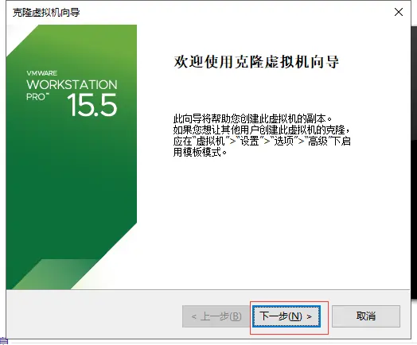
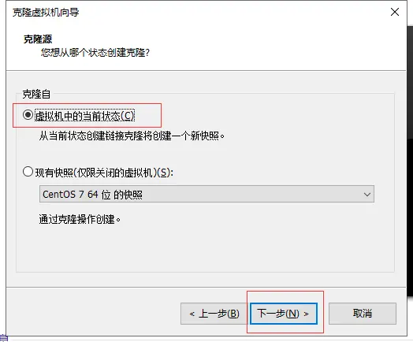
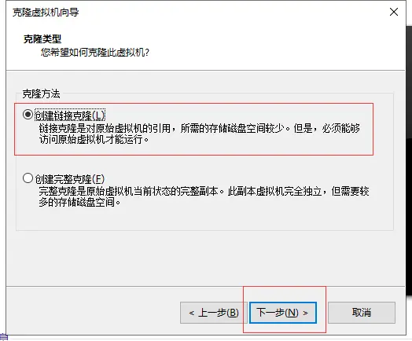
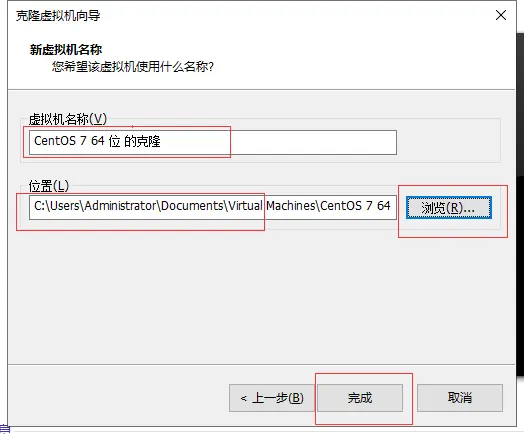
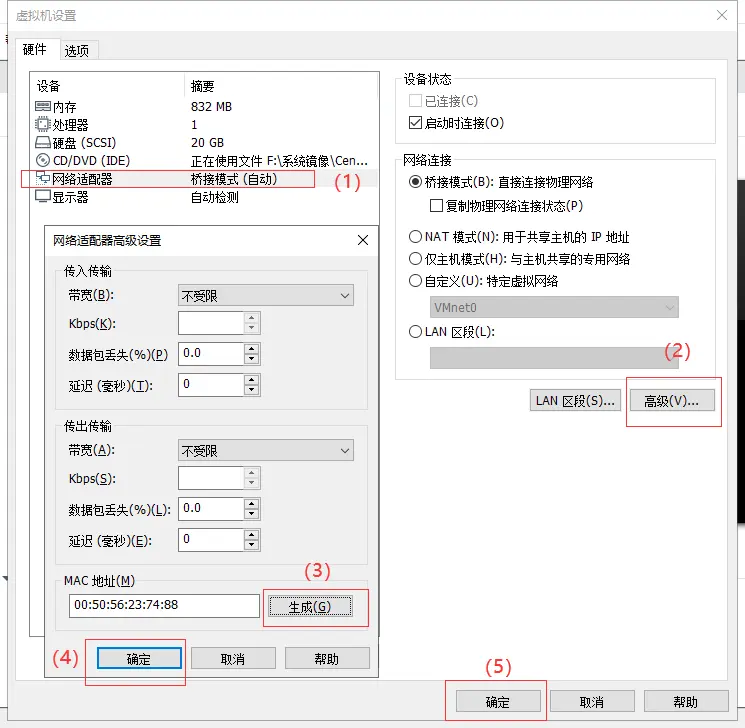
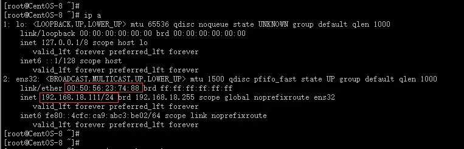
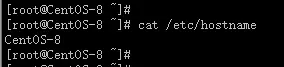
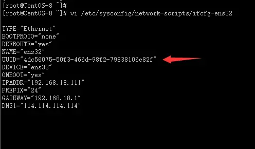
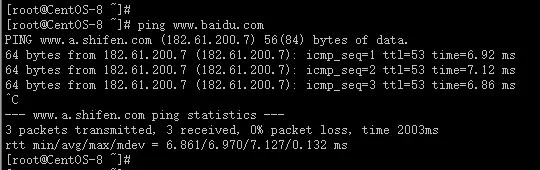

> 虚拟机克隆分为“完整克隆”（Full Clone）和“链接克隆”（Linked Clone）两种方式：
> 
> 克隆完成后，新虚拟机和原始虚拟机 必须具有不同的MAC地址、主机名、IP地址和UUID，这才允许克隆的虚拟机和原始虚拟机在同一网络中出现，并且不会产生任何冲突。
> 
> **VMware 完整克隆（****Full Clone****）**
> 
> 完全克隆的虚拟机不依赖源虚拟机，是完全独立的虚拟机，它的性能与被克隆虚拟机相同。
> 
> 由于完整克隆不与父虚拟机共享虚拟磁盘，所以创建完整克隆所需的时间比链接克隆更长。如果涉及的文件较大，完整克隆可能需要数分钟才能创建完成。完整克隆只复制克隆操作时的虚拟机状态，因此无法访问父虚拟机的快照。
> 
> **VMware 链接克隆（****Linked Clone****）**
> 
> 依赖于源虚拟机（称为父虚拟机）。由于链接克隆是通过父虚拟机的快照创建而成，因此节省了磁盘空间，而且克隆速度非常快，但是克隆后的虚拟机性能能会有所下降。
> 
> 对父虚拟机的虚拟磁盘进行的更改不会影响链接克隆，对链接克隆磁盘所做的更改也不会影响父虚拟机。但是如果父虚拟机损坏或快照点删除，链接克隆的虚拟机也不能使用；如果父虚拟机移动位置，需要重新指定父虚拟机的位置，再启动链接克隆虚拟机。

首先说明白一点，不管是以任何方式克隆出来的虚拟机，cpu、内存的占用应该是多少就是多少，关键是在于虚拟磁盘是否和原始度虚拟机共享。

完整克隆和链接克隆都可以从字面意思上来看出端倪，所说的完整克隆就是把原始的虚拟机全部状态的一个拷贝，除了知mac地址和UUID，其余虚拟机的配置都是一样的，克隆出来的虚拟机和原始的虚拟机是相互独立的不共享任何资源，都有自己独道立的CPU、内存和存储空间，好处就是安全性更高；而链接克隆呢，字面意思是通过链接......克隆出一个虚拟机，肯定是和原始的虚拟机有关系的，虽然版服务器会给克隆出的虚拟机分配新的CPU和内存，但是他们共享一个虚拟磁盘文件，克隆出来的虚拟机是不能脱离原始虚拟机独立运行，好处就是链接克隆虚拟机更快，节省空间，相比较来说不是那么安全。

  1、虚拟机克隆步骤

依次点击“虚拟机-管理-克隆” 出现虚拟机克隆向导：



根据自己需求进行选择“克隆源” ：



根据自己需求进行选择“克隆方式” ：



根据自己需求进行选择 “虚拟机名称” 和 “虚拟机存放的位置”



2、 虚拟机克隆完成以后的注意事项

1）修改新生产虚拟机的MAC地址

因为克隆过后的虚拟机和原来的虚拟机基本一模一样，为了使克隆出来的虚拟机可以正常使用，必须和原来的区别开才行

选中新虚拟机，选择编辑虚拟机设置（或者右键设置），选择网络适配器，然后点击右边的高级，如下图所示：



进入新虚拟机系统查看网卡ens32的MAC地址是否已经变成我们刚刚重新生成的地址，如果已经发生变更那就没必要再去配置文件做修改了；如果还没有发生变更的话，那就把生成的MAC地址写入新虚拟机的 `/etc/sysconfig/network-scripts/ifcfg-ens33` 文件中即可

2）修改IP地址

因为克隆过后的虚拟机和原来的虚拟机基本一模一样，为了使克隆出来的虚拟机可以正常使用，必须和原来的区别开才行

编辑新虚拟机的网卡配置文件 /etc/sysconfig/network-scripts/ifcfg-ens33 ，修改IP地址为自己想要的即可：

```
[root@CentOS-8 ~]# vi  /etc/sysconfig/network-scripts/ifcfg-ens33    
```
          

修改完IP一定要重启网卡才能生效：

```
[root@CentOS-8 ~]# systemctl restart network
[root@CentOS-8 ~]# ip  a
```



3）修改主机名

因为克隆过后的虚拟机和原来的虚拟机基本一模一样，为了使克隆出来的虚拟机可以正常使用，必须和原来的区别开才行

```
[root@CentOS-8 ~]# cat  /etc/hostname
```



4）修改 UUID 值

因为克隆过后的虚拟机和原来的虚拟机基本一模一样，为了使克隆出来的虚拟机可以正常使用，必须和原来的区别开才行

方法：在新虚拟机端输入命令 uuidgen，将生成的UUID写入网卡配置文件（ifcfg-ens32）中即可

```
[root@CentOS-8 ~]# uuidgen               #生产新的UUID值
4dc56075-50f3-466d-98f2-79838106e82f
[root@CentOS-8 ~]#
[root@CentOS-8 ~]# vi  /etc/sysconfig/network-scripts/ifcfg-ens32 
```



```
[root@CentOS-8 ~]# systemctl  restart  network       #修改完成，重启网络服务
```

5）测试访问网络

```
[root@CentOS-8 ~]# ping  www.baidu.com
```



3、实验结论

经过上述的修改以后，新虚拟机可以正常投入使用了